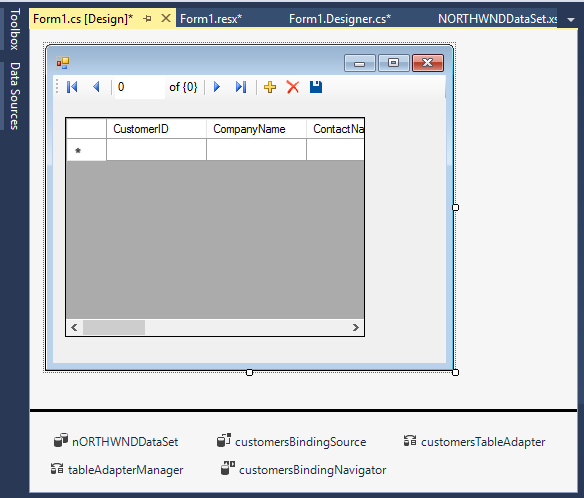
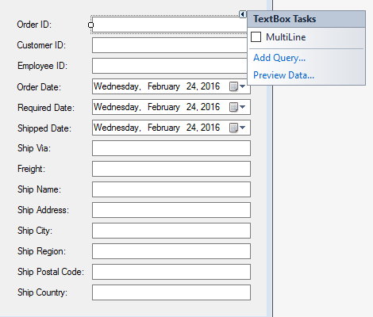

# Bind Windows Forms controls to data
You can bind data sources to controls by dragging objects from the **Data Sources** window onto a Windows Form or onto an existing control on a form. Before you drag items, you can set the type of control you want to bind to. Different values appear depending on whether you choose the table itself, or an individual column.  You can also set custom values. For a table, "Details" means that each column is bound to a separate control.  
  
   
  
 [!INCLUDE[note_settings_general](../data-tools/includes/note_settings_general_md.md)]  
  
## Bind to  data in a DataGridView control  
 For DataGridView, the entire table is bound to that single control. When you drag a DataGridView to the form, a tool strip for navigating records (<xref:System.Windows.Forms.BindingNavigator>) also appears. A [DataSet](../data-tools/dataset-tools-in-visual-studio.md), [TableAdapter](../data-tools/tableadapter-overview.md), <xref:System.Windows.Forms.BindingSource>, and <xref:System.Windows.Forms.BindingNavigator> appear in the component tray. In the following illustration, a TableAdapterManager is also added because the Customers table has a relation to the Orders table. These variables are all declared in the auto-generated code as private members in the form class. The auto-generated code for filling the DataGridView is located in the form_load event handler. The code for saving the data to update the database is located in the Save event handler for the BindingNavigator. You can move or modify this code as needed.  
  
   
  
 You can customize the behavior of the DataGridView and the BindingNavigator by clicking on the smart tag in the upper right corner of each:  
  
   
  
 If the controls your application needs are not available from within the **Data Sources** window, you can add controls. For more information, see [Add custom controls to the Data Sources window](../data-tools/add-custom-controls-to-the-data-sources-window.md).  
  
 You can also drag items from the **Data Sources** window onto controls already on a form to bind the control to data. A control that is already bound to data has its data bindings reset to the item most recently dragged onto it. To be valid drop targets, controls must be capable of displaying the underlying data type of the item dragged onto it from the **Data Sources** window. For example, it's not valid to drag an item that has a data type of <xref:System.DateTime> onto a <xref:System.Windows.Forms.CheckBox>, because the <xref:System.Windows.Forms.CheckBox> is not capable of displaying a date.  
  
## Bind to  data in individual controls  
 When you bind a data source to "Details," each column in the dataset is bound to a separate control.  
  
   
  
> [!IMPORTANT]
>  Note that in the previous  illustration, you drag from the Orders property of the Customers table, not from the Orders table. By binding to the Customer.Orders property, navigation commands made in the DataGridView are reflected immediately in the details controls. If you dragged from the Orders table, the controls would still be bound to the dataset, but not they would not be synchronized with the DataGridView.  
  
 The following illustration shows the default data-bound controls that are added to the form after the Orders property in the Customers table is bound to "Details" in the **Data Sources** window.  
  
   
  
 Note also that each control has a smart tag. This tag enables customizations that apply to that control only.  
  
## See Also  
 [Bind Windows Forms controls to data in Visual Studio](../data-tools/bind-windows-forms-controls-to-data-in-visual-studio.md)