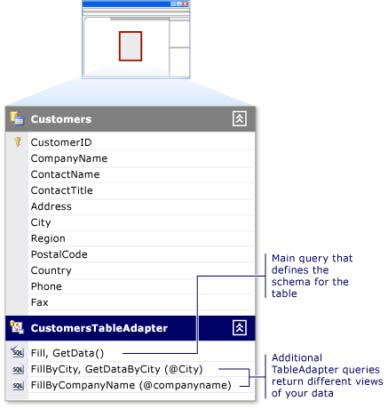

# How to: Edit TableAdapter Queries
You edit TableAdapter queries with the [Editing TableAdapters](../data-tools/editing-tableadapters.md) in the **Dataset Designer**. You should modify a TableAdapter query when it no longer suits the needs of your application. (Alternatively, you can create additional queries on the TableAdapter. For more information on adding new queries, see [How to: Create TableAdapter Queries](../data-tools/how-to-create-tableadapter-queries.md).)  
  
> [!NOTE]
>  If the [TableAdapter Configuration Wizard](http://msdn.microsoft.com/en-us/Library/3a373dd9-7b34-4d3c-a48b-69414512bac8) opens instead of the **TableAdapter Query Configuration Wizard**, you might have selected the TableAdapter's main `Fill` query and not one of the TableAdapter's additional queries. For information on editing the TableAdapter's main `Fill` query, see [How to: Edit TableAdapters](http://msdn.microsoft.com/en-us/Library/ca178745-e35a-45f1-a395-23cddfd8f855).  
  
   
  
### To edit a TableAdapter query  
  
1.  Open the dataset in the **Dataset Designer**. For more information, see [How to: Open a Dataset in the Dataset Designer](http://msdn.microsoft.com/en-us/Library/36fc266f-365b-42cb-aebb-c993dc2c47c3).  
  
2.  Select the TableAdapter query you want to edit.  
  
3.  Right-click the TableAdapter query and select **Configure**.  
  
     The **TableAdapter Query Configuration Wizard** opens, ready for you to modify the query or stored procedure for that query.  
  
4.  Complete the **TableAdapter Query Configuration Wizard** with the changes that you want. For more information, see [Editing TableAdapters](../data-tools/editing-tableadapters.md).  
  
## See Also  
 [TableAdapters](http://msdn.microsoft.com/en-us/Library/09416de9-134c-4dc7-8262-6c8d81e3f364)   
 [Connecting to Data in Visual Studio](../data-tools/connecting-to-data-in-visual-studio.md)   
 [Preparing Your Application to Receive Data](http://msdn.microsoft.com/en-us/Library/c17bdb7e-c234-4f2f-9582-5e55c27356ad)   
 [Fetching Data into Your Application](../data-tools/fetching-data-into-your-application.md)   
 [Bind controls to data in Visual Studio](../data-tools/bind-controls-to-data-in-visual-studio.md)   
 [Editing Data in Your Application](../data-tools/editing-data-in-your-application.md)   
 [Validating Data](http://msdn.microsoft.com/en-us/Library/b3a9ee4e-5d4d-4411-9c56-c811f2b4ee7e)   
 [Saving Data](../data-tools/saving-data.md)   
 [Data Walkthroughs](http://msdn.microsoft.com/en-us/Library/15a88fb8-3bee-4962-914d-7a1f8bd40ec4)