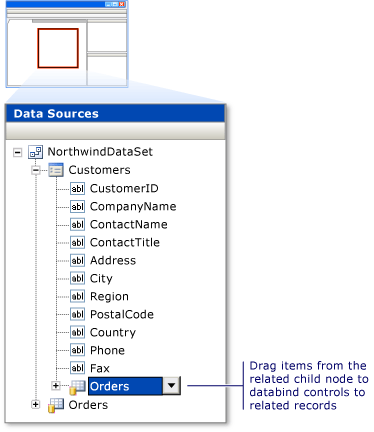

# Walkthrough: Displaying Related Data on a Windows Form
In many application scenarios, you want to work with data that comes from more than one table and, often, data from related tables. That is, you want to work with a parent-child relationship. For example, you might want to create a form where selecting a customer record displays the orders for that customer. Displaying the related records on the form is achieved by setting the <xref:System.Windows.Forms.BindingSource.DataSource%2A> property of the child <xref:System.Windows.Forms.BindingSource> to the parent <xref:System.Windows.Forms.BindingSource> (not the child table), and setting the <xref:System.Windows.Forms.BindingSource.DataMember%2A> property of the child <xref:System.Windows.Forms.BindingSource> to the data relation that ties the parent and child tables together.  
  
 Tasks illustrated in this walkthrough include:  
  
-   Creating a **Windows Application** project.  
  
-   Creating and configuring a dataset in your application based on the `Customers` and `Orders` tables in the Northwind database using the [Data Source Configuration Wizard](../data-tools/media/data-source-configuration-wizard.png).  
  
-   Adding controls to display data from the `Customers` table.  
  
-   Adding controls to display the `Orders` based on the selected `Customer`.  
  
-   Testing the application by selecting different customers and verifying that the correct orders are displayed for the selected customer.  
  
## Prerequisites  
 In order to complete this walkthrough, you need:  
  
-   Access to the Northwind sample database. To setup sample databases, see [How to: Install Sample Databases](../data-tools/how-to-install-sample-databases.md).  
  
## Creating the Project  
 The first step is to create a **Windows Application**.  
  
#### To create the Windows Application project  
  
1.  From the **File** menu, create a new project.  
  
2.  Name the project `RelatedDataWalkthrough`.  
  
3.  Select **Windows Application** and click **OK**. For more information, see [Client Applications](../Topic/Developing%20Client%20Applications%20with%20the%20.NET%20Framework.md).  
  
     The **RelatedDataWalkthrough** project is created and added to **Solution Explorer**.  
  
## Creating the Data Source  
 This step creates a dataset based on the `Customers` and `Orders` tables in the Northwind sample database.  
  
#### To create the data source  
  
1.  On the **Data** menu, click **Show Data Sources**.  
  
2.  In the **Data Sources** window, select **Add New Data Source** to start the **Data Source Configuration Wizard**.  
  
3.  Select **Database** on the **Choose a Data Source Type** page, and then click **Next**.  
  
4.  On the **Choose your Data Connection** page do one of the following:  
  
    -   If a data connection to the Northwind sample database is available in the drop-down list, select it.  
  
         -or-  
  
    -   Select **New Connection** to launch the **Add/Modify Connection** dialog box.  
  
5.  If your database requires a password, select the option to include sensitive data, and then click **Next**.  
  
6.  Click **Next** on the **Save connection string to the Application Configuration file** page.  
  
7.  Expand the **Tables** node on the **Choose your Database Objects** page.  
  
8.  Select the **Customers** and **Orders** tables, and then click **Finish**.  
  
     The **NorthwindDataSet** is added to your project and the **Customers** table appears in the **Data Sources** window.  
  
## Creating Controls to Display Data from the Customers Table  
  
#### To create controls to display the customer data (parent records)  
  
1.  In the **Data Sources** window, select the **Customers** table, and then click the drop-down arrow.  
  
2.  Choose **Details** from the menu.  
  
3.  Drag the main **Customers** node from the **Data Sources** window onto the top of **Form1**.  
  
     Data-bound controls with descriptive labels appear on the form, along with a tool strip (<xref:System.Windows.Forms.BindingNavigator>) for navigating records. A [NorthwindDataSet](../data-tools/dataset-tools-in-visual-studio.md), [CustomersTableAdapter](../data-tools/tableadapter-overview.md), <xref:System.Windows.Forms.BindingSource>, and <xref:System.Windows.Forms.BindingNavigator> appear in the component tray.  
  
## Creating Controls to Display Data from the Orders Table  
   
  
#### To create controls to display the orders for each customer (child records)  
  
-   In the **Data Sources** window, expand the **Customers** node and select the last column in the **Customers** table, which is an expandable **Orders** node, and drag it onto the bottom of **Form1**.  
  
     A <xref:System.Windows.Forms.DataGridView> is added to the form, and a new <xref:System.Windows.Forms.BindingSource> (`OrdersBindingSource`) and TableAdapter (`OrdersTableAdapter`) are added to the component tray.  
  
    > [!NOTE]
    >  Open the [Properties Window](../ide/reference/properties-window.md) and select the **OrdersBindingSource**. Inspect the <xref:System.Windows.Forms.BindingSource.DataSource%2A> and <xref:System.Windows.Forms.BindingSource.DataMember%2A> properties to see how binding is configured to display related records. The <xref:System.Windows.Forms.BindingSource.DataSource%2A> is set to the `CustomersBindingSource` (the parent table's <xref:System.Windows.Forms.BindingSource>), rather than the `Orders` table. The <xref:System.Windows.Forms.BindingSource.DataMember%2A> property is set to `FK_Orders_Customers`, which is the name of the <xref:System.Data.DataRelation> object that relates the tables together.  
  
## Testing the Application  
  
#### To test the application  
  
1.  Press F5 to run the application.  
  
2.  Select different customers using the **CustomersBindingNavigator** to verify the correct orders are displayed in the <xref:System.Windows.Forms.DataGridView>.  
  
## Next Steps  
 Depending on your application requirements, there are several steps you may want to perform after creating a master-detail form. One enhancement you could make to this walkthrough is:  
  
-   Filtering the `Customers` records by adding parameterization to the `Customers` table. To do this, select any control that displays data from the `Customers` table, click the smart tag, and choose **Add Query**. Complete the [Search Criteria Builder Dialog Box](../Topic/Search%20Criteria%20Builder%20Dialog%20Box.md). For more information, see [How to: Add a Parameterized Query to a Windows Forms Application](../Topic/How%20to:%20Add%20a%20Parameterized%20Query%20to%20a%20Windows%20Forms%20Application.md).  
  
## See Also  
 [Data Walkthroughs](../Topic/Data%20Walkthroughs.md)   
 [Data Sources Window](../Topic/Data%20Sources%20Window.md)   
 [Bind Windows Forms controls to data in Visual Studio](../data-tools/bind-windows-forms-controls-to-data-in-visual-studio.md)   
 [Add new data sources](../data-tools/add-new-data-sources.md)   
 [TableAdapter Overview](../data-tools/tableadapter-overview.md)   
 [How to: Display Related Data in a Windows Forms Application](../data-tools/how-to-display-related-data-in-a-windows-forms-application.md)   
 [BindingSource Component Overview](../Topic/BindingSource%20Component%20Overview.md)   
 [BindingNavigator Control Overview](../Topic/BindingNavigator%20Control%20Overview%20\(Windows%20Forms\).md)