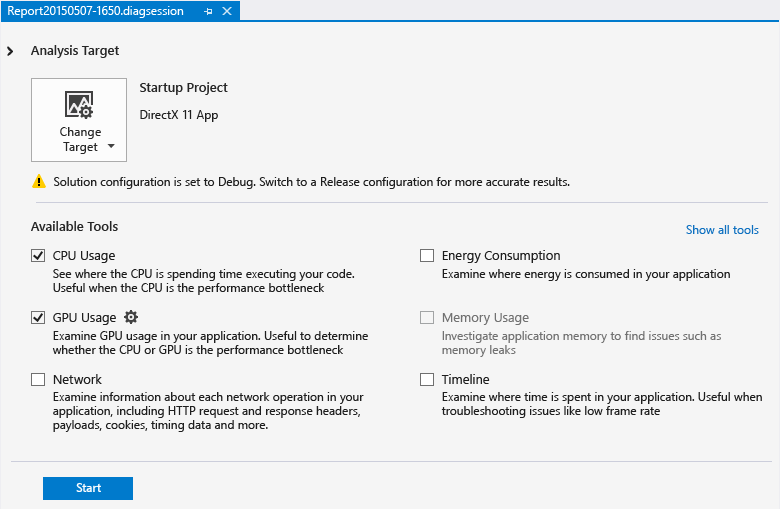
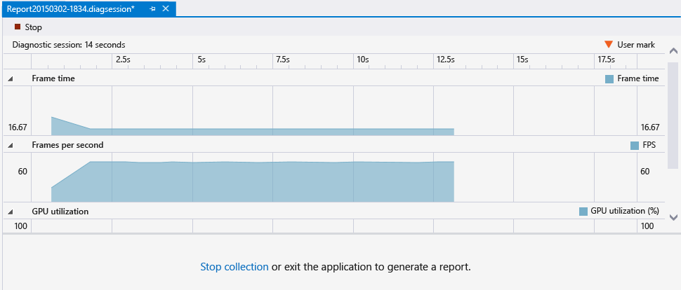
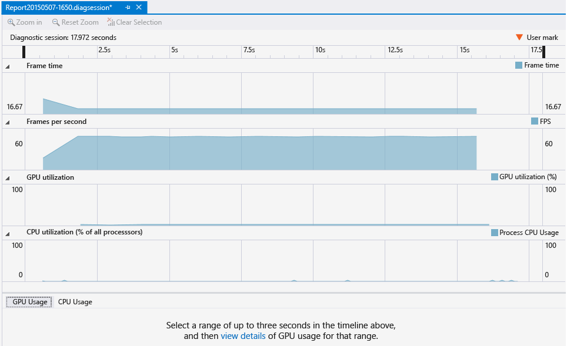
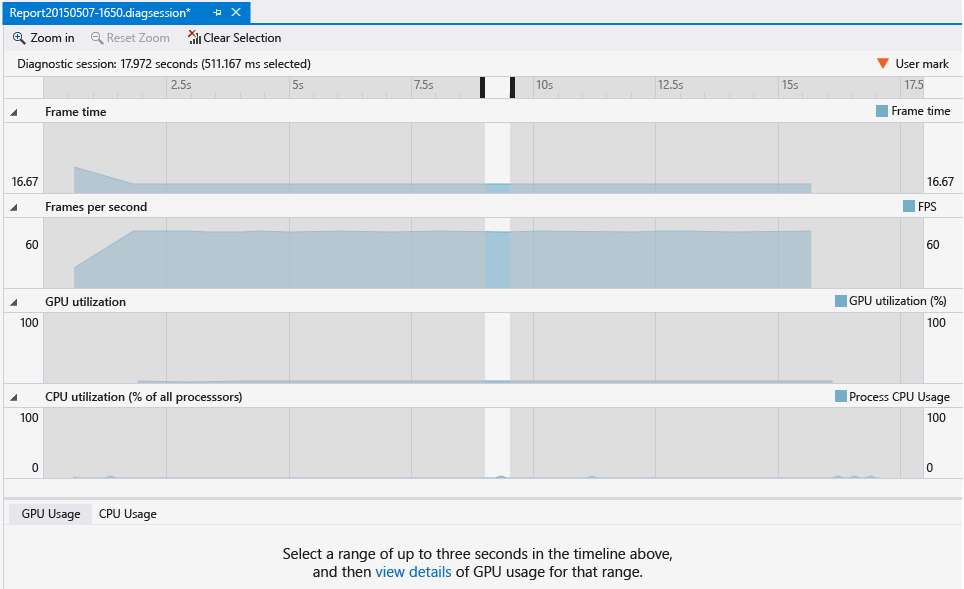
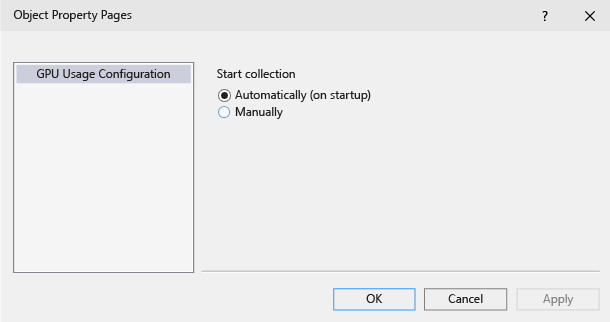

# GPU Usage
Use the GPU Usage tool in the Visual Studio Performance and Diagnostics Hub to better understand the high-level hardware utilization of your Direct3D app. You can use it to determine whether the performance of your app is CPU-bound or GPU-bound and gain insight into how you can use the platform's hardware more effectively. GPU Usage supports apps that use Direct3D 12, Direct3D 11, and Direct3D 10; it doesn't support other graphics APIs such as Direct2D or OpenGL.  
  
 This is the **GPU Usage Report** window:  
  
   
  
## Requirements  
 The following are requirements for using the GPU Usage tool that are in addition to Graphics Diagnostics requirements.  
  
-   A GPU and driver that support the necessary timing instrumentation.  
  
    > [!NOTE]
    >  For more information on supported hardware and drivers, see [Hardware and driver support](#hwsupport) at the end of this document.  
  
 For more information about Graphics Diagnostics requirements, see [Getting Started](../debugger/getting-started-with-visual-studio-graphics-diagnostics.md).  
  
## Using the GPU Usage tool  
 When you run your app under the GPU Usage tool, Visual Studio creates a diagnostic session that graphs high-level information about your app’s rendering performance and GPU utilization in real-time.  
  
#### To start the GPU Usage tool:  
  
1.  In the main menu, choose **Debug**, then **Performance and Diagnostics** (Keyboard: Press Alt+F2).  
  
2.  In the Performance and Diagnostics hub, check the box next to **GPU Usage**. Optionally, check the boxes next to other tools you’re interested in. You can run several Performance and Diagnostics tools concurrently to get a fuller picture of your app’s performance.  
  
       
  
    > [!NOTE]
    >  Not all Performance and Diagnostics tools can be used at the same time.  
  
3.  Choose the blue **Start** button at the bottom of the Performance and Diagnostics hub to run your app under the tools you selected.  
  
 The high-level information that’s displayed in real-time includes frame timing, frame rate, and GPU utilization. Each of these pieces of information are graphed independently, but use a common time-scale so that you can easily relate between them.  
  
 The **Frame time (ms)** and **Frames per second (FPS)** graphs contain two red, horizontal lines that represent performance targets of 60 and 30 frames per second. In the **Frame time** graph, your app is exceeding the performance target when the graph is below the line and missing it when the graph is above the line. For the Frames per second graph it’s the opposite – your app is exceeding the performance target when the graph is above the line and missing it when the graph is below the line. Primarily, these graphs are used to get a high-level idea of your app’s performance and to identify slow-downs that you might want to investigate -- for example, a sudden drop in frame rate or a spike in GPU Utilization.  
  
 While your app runs under the GPU Usage tool, the diagnostics session also collects detailed information about graphics events that were executed on the GPU. This information is used to generate a more granular report of how your app utilizes the hardware. Because this report takes some time to generate from the collected information, it’s only available after the diagnostics session is done collecting information.  
  
 When you want to look at a performance or utilization issue more closely, stop collecting performance information so that the report can be generated.  
  
#### To generate and view the GPU Usage Report:  
  
1.  In the bottom portion of the diagnostics session window, choose the **Stop Collection** link or press **Stop** in the upper left-hand corner.  
  
       
  
2.  In the top portion of the report, select a section from one of the graphs that shows the issue you want to investigate. Your selection can be up to 3 seconds long; longer sections are truncated towards the beginning.  
  
       
  
3.  In the bottom portion of the report, choose the **view details** link in the **…click here to view details of GPU usage for that range** message to view a detailed timeline of your selection.  
  
       
  
 This opens a new tabbed document that contains the report. The GPU Usage report helps you to see when a graphics event is started on the CPU, when it reaches the GPU, and how long it takes the GPU to execute it. This information can help you to identify bottlenecks and opportunities for increased parallelism in your code.  
  
## Using the GPU Usage report  
 The top portion of the GPU Usage report displays timelines for the CPU processing activity, GPU rendering activity and GPU copy activity. These timelines are divided by light-grey, vertical bars that represent the display's vsync; the frequency of the bars matches the refresh rate of one of the displays (selected by using the **Display** drop-down) that GPU Usage data was collected from. Because the display might have a higher refresh rate than your app's performance target there might not be a 1-to-1 relationship between vsync and the frame-rate you want your app to achieve. To meet its performance target an app must complete all processing, perform rendering, and make a Present() call at the targeted framerate, but the rendered frame will not be displayed until the next vsync after Present().  
  
 The bottom portion displays a listing of the graphics events that occurred during the time period of the report.  
  
 Here’s the **GPU Usage Report** window:  
  
   
  
 Selecting one of the events in the bottom portion of the report places a marker at corresponding events in the relevant timelines, typically one event on a CPU thread that represents the API call and another event on one of the GPU timelines that represents when the GPU completed the task. Likewise, selecting one of the events in a timeline highlights the corresponding event in the bottom portion of the report.When zoomed out of the timelines in the top portion of the report, only the most time-consuming events are visible. To see events that have a shorter duration, zoom into the timelines by using Ctrl + wheel on your pointing device, or the scaling control in the lower left-hand corner of the top panel. You can also drag the timeline panel’s contents to move through the recorded events.  
  
 To help you find what you’re looking for, you can filter the GPU Usage Report based on Process names, Thread IDs, and the event name; additionally, you can choose which display's refresh rate determines the vysnc lines and you can sort events hierarchically if your app uses the ID3DUserDefinedAnnotation interface to group rendering commands.  
  
 Here are more details:  
  
|Filter control|Description|  
|--------------------|-----------------|  
|**Process**|The name of the process you are interested in. All processes that used the GPU during the diagnostics session are included in this dropdown. The color associated with the process in this drop down is the color of the thread’s activity in the timelines below.|  
|**Thread**|The thread ID that you are interested in. In a multi-threaded app, this can help you isolate particular threads that belong to the process that you’re interested in. Events associated with the selected thread are highlighted in each timeline.|  
|**Display**|The number of the display whose refresh rate is displayed **Note:**  Some drivers can be configured to present multiple physical displays as a single, large virtual display. You might see just one display listed, even if the machine has multiple displays attached.|  
|**Filter**|Keywords that you are interested in. Events in the bottom portion of the report will only include those that match a keyword in whole or in part. You can specify multiple keywords by separating them with a semicolon (;).|  
|**Hierarchy Sort**|A checkbox that indicates whether event hierarchies--defined through user markers--are preserved or ignored.|  
  
 The list of events in the bottom portion of the GPU Usage Report displays the details of each event.  
  
|Column|Description|  
|------------|-----------------|  
|**Event Name**|The name of the graphics event. An event usually corresponds to one event in a CPU thread timeline and one event on a GPU timeline.   Event names might be 'unattributed' if GPU Usage was unable to determine the name of an event. For more information, see the note below this table.|  
|**CPU Start (ns)**|The time that the event was initiated on the CPU by calling a Direct3D API. The time Is measured in nanoseconds, relative to when the app started.|  
|**GPU Start (ns)**|The time that the event was initiated on the GPU. The time is measured in nanoseconds, relative to when the app started.|  
|**GPU Duration (ns)**|The time that the event took to complete on the GPU, in nanoseconds.|  
|**Process Name**|The name of the app from which the event came.|  
|**Thread ID**|The thread ID from which the event came.|  
  
> [!IMPORTANT]
>  Windows 8.1 is required for event attribution. Additionally, if your GPU or driver don’t support the necessary instrumentation features, all events will appear as 'unattributed'. Make sure to update your GPU driver and try again if you experience this problem. For more information, see [Hardware and driver support](#hwsupport) below.  
  
## GPU Usage settings  
 You can configure the GPU Usage tool to postpone collection of profiling information, rather than starting to collect information as soon as the app starts. Because the size of the profiling information can be significant, this is useful when you know that slowdowns in your app’s performance won’t appear until later.  
  
#### To postpone profiling from the start of the app:  
  
1.  In the main menu, choose **Debug**, then **Performance and Diagnostics** (Keyboard: Press Alt+F2).  
  
2.  In the Performance and Diagnostics hub, follow the **settings** link next to **GPU Usage**.  
  
3.  Under **GPU Profiling Configuration**, on the **General** property page, clear the **Begin profiling at app start** checkbox to postpone profiling.  
  
       
  
> [!IMPORTANT]
>  Postponing profiling is not currently supported for Direct3D 12 apps.  
  
 When you postpone the collection of profiling information by using this setting, an additional link becomes available in the bottom portion of the GPU Usage tool window when you run your app under the GPU Usage tool. To start collecting profiling information, choose the **Start** link in the **Start collecting additional detailed GPU Usage Data** message.  
  
##   Hardware and driver support  
 The following GPU hardware and drivers are supported:  
  
|Vendor|GPU Description|Driver Version Required|  
|------------|---------------------|-----------------------------|  
|Intel®|4th Generation Intel® Core Processors (‘Haswell’)   -   Intel® HD Graphics (GT1) -   Intel® HD Graphics 4200 (GT2) -   Intel® HD Graphics 4400 (GT2) -   Intel® HD Graphics 4600 (GT2) -   Intel® HD Graphics P4600 (GT2) -   Intel® HD Graphics P4700 (GT2) -   Intel® HD Graphics 5000 (GT3) -   Intel® Iris™ Graphics 5100 (GT3) -   Intel® Iris™ Pro Graphics 5200 (GT3e)|-- (use latest drivers)|  
|AMD®|Most since AMD Radeon™ HD 7000-series (excludes AMD Radeon™ HD 7350-7670)   AMD Radeon™ GPU, AMD FirePro™ GPUs, and AMD FirePro GPU accelerators featuring Graphics Core Next (GCN) architecture.   AMD® E-Series and AMD A-series Accelerated Processing Units (APUs) featuring Graphics Core Next (GCN) architecture (‘Kaveri’, ‘Kabini’, ‘Temash’ , ‘Beema’, ‘Mullins’)|14.7 RC3 or higher|  
|NVIDIA®|Most since NVIDIA® GeForce® 400-series.   NVIDIA® GeForce® GPUs, NVIDIA Quadro® GPUs and NVIDIA® Tesla™ GPU accelerators featuring Fermi™, Kepler™, or Maxwell™ architecture.|343.37 or higher|  
  
 Multi-GPU configurations such as NVIDIA® SLI™ and AMD Crossfire™ are not supported at this time. Hybrid graphics setup, such as NVIDIA® Optimus™ and AMD Enduro™ are supported.  
  
## See also  
  
-   [Solve the Tough Graphics Problems with your Game Using DirectX Tools (video)](http://channel9.msdn.com/Events/GDC/GDC-2015/Solve-the-Tough-Graphics-Problems-with-your-Game-Using-DirectX-Tools)  
  
-   [GPU Usage Tool in Visual Studio (video)](http://channel9.msdn.com/Events/Visual-Studio/Connect-event-2014/715)  
  
-   [GPU Usage tool in Visual Studio 2013 Update 4 CTP1 (blog)](http://blogs.msdn.com/b/vcblog/archive/2014/09/05/gpu-usage-tool-in-visual-studio-2013-update-4-ctp1.aspx)  
  
-   [GPU Usage for DirectX in Visual Studio (blog)](http://blogs.msdn.com/b/ianhu/archive/2014/12/16/gpu-usage-for-directx-in-visual-studio.aspx)