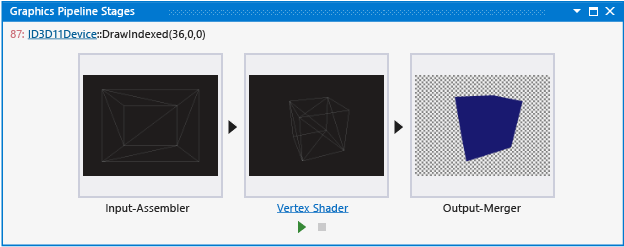
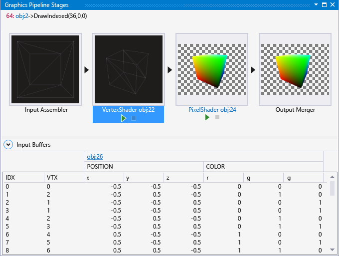
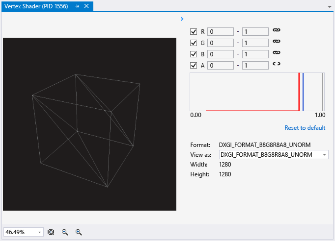

# Graphics Pipeline Stages
The Graphics Pipeline Stages window helps you understand how an individual draw call is transformed by each stage of the Direct3D graphics pipeline.  
  
 This is the Pipeline Stages window:  
  
   
  
## Understanding the Graphics Pipeline Stages window  
 The Pipeline Stages window visualizes the result of each stage of the graphics pipeline separately, for each draw call. Normally, the results of stages in the middle of the pipeline are hidden, making it difficult to tell where a rendering problem started. By visualizing each stage separately, the Pipeline Stages window makes it easy to see where the problem starts—for example, you can easily see when the vertex shader stage unexpectedly causes an object to be drawn off-screen.  
  
 After you've identified the stage in which the problem occurs, you can use the other Graphics Analyzer tools to examine how the data was interpreted or transformed. Rendering problems that appear in the pipeline stages are often related to incorrect vertex format descriptors, buggy shader programs, or misconfigured state.  
  
### Links to related graphics objects  
 Sometimes additional context is needed to determine why a draw call interacts in a particular way with the graphics pipeline. To make this additional context easier to find, the Graphics Pipeline Stages window links to one or more objects that provide additional context related to what's happening in the graphics pipeline.  
  
-   In Direct3D 12 this object is usually a command list.  
  
-   In Direct3D 11 this object is usually a graphics device context.  
  
 These links are part of the current graphics event signature that's located in the upper left-hand corner of the Graphics Pipeline Stages window. Follow any of these links to examine additional details about the object.  
  
### Viewing and debugging shader code  
 You can examine and debug code for vertex, hull, domain, geometry and pixel shaders by using the controls at the bottom of their respective stages in the Pipeline Stages window.  
  
##### To view a shader's source code  
  
-   In the **Graphics Pipeline Stages** window, locate the shader stage that corresponds to the shader you want to examine. Then, below the preview image, follow the shader stage title link—for example, follow the link **Vertex Shader obj:30** to view the vertex shader source code.  
  
    > [!TIP]
    >  The object number, **obj:30**, identifies this shader throughout the Graphics Analyzer interface such as in the object table and pixel history window.  
  
##### To debug a shader  
  
-   In the **Graphics Pipeline Stages** window, locate the shader stage that corresponds to the shader you want to debug. Then, below the preview image, choose **Start Debugging**. This entry point into the HLSL debugger defaults to the first invocation of the shader for the corresponding stage—that is, the first pixel, vertex, or primitive that's processed by the shader during this draw call. Invocations of this shader for a specific pixel or vertex can be accessed through the **Graphics Pixel History**.  
  
### The pipeline stages  
 The Pipeline Stages window visualizes only the stages of the pipeline that were active during the draw call. Each stage of the graphics pipeline transforms input from the previous stage and passes the result to the next stage. The very first stage—the Input Assembler—takes index and vertex data from your app as its input; the very last stage—the Output Merger—combines newly rendered pixels together with the current contents of the framebuffer or render target as its output to produce the final image you see on your screen.  
  
> [!NOTE]
>  Compute shaders are not supported in the **Graphics Pipeline Stages** window.  
  
 **Input Assembler**  
 The Input Assembler reads index and vertex data specified by your app and assembles it for the graphics hardware.  
  
 In the Pipeline Stages window, the Input Assembler output is visualized as a wireframe model. To take a closer look at the result, select **Input Assembler** in the **Graphics Pipeline Stages** window to view the assembled vertices in full 3D using the Model Editor.  
  
> [!NOTE]
>  If the `POSITION` semantic is not present in the input assembler output, then nothing is displayed in the **Input Assembler** stage.  
  
 **Vertex Shader**  
 The vertex shader stage processes vertices, typically performing operations such as transformation, skinning, and lighting. Vertex shaders produce the same number of vertices that they takes as input.  
  
 In the Pipeline Stages window, the Vertex Shader output is visualized as a wireframe raster image. To take a closer look at the result, select **Vertex Shader** in the **Graphics Pipeline Stages** windows to view the processed vertices in the Image Editor.  
  
> [!NOTE]
>  If the `POSITION` or `SV_POSITION` semantics are not present in the vertex shader output, then nothing is displayed in the **Vertex Shader** stage.  
  
 **Hull Shader** (Direct3D 11 and Direct3D 12 only)  
 The hull shader stage processes control points that define a low-order surface such as a line, triangle, or quad. As output it produces a higher-order geometry patch and patch constants that are passed to the fixed-function tessellation stage.  
  
 The hull shader stage is not visualized in the Pipeline Stages window.  
  
 **Tessellator Stage** (Direct3D 11 and Direct3D 12 only)  
 The tessellator stage is a fixed function (non-programmable) hardware unit that preprocesses the domain represented by the output of the hull shader. As output, it creates a sampling pattern of the domain and a set of smaller primitives—points, lines, triangles—that connect these samples.  
  
 The tessellator stage is not visualized in the Pipeline Stages window.  
  
 **Domain Shader** (Direct3D 11 and Direct3D 12 only)  
 The domain shader stage processes higher-order geometry patches from the Hull shader, together tessellation factors from the tessellation stage. The tessellation factors can be include tessellator input factors as well as output factors. As output, it calculates the vertex position of a point on the output patch according the tessellator factors.  
  
 The domain shader stage is not visualized in the Pipeline Stages window.  
  
 **Geometry Shader**  
 The geometry shader stage processes entire primitives—points, lines, or triangles—along with optional vertex data for edge-adjacent primitives. Unlike vertex shaders, geometry shaders can produce more or fewer primitives than they take as input.  
  
 In the Pipeline Stages window, geometry shader output is visualized as a wireframe raster image. To take a closer look at the result, select **Geometry Shader** in the **Graphics Pipeline Stages** window to view the processed primitives in the Image Editor.  
  
 **Stream Output Stage**  
 The stream output stage can intercept transformed primitives prior to rasterization and write them to memory; from there the data can be recirculated as input to earlier stages of the graphics pipeline or be read back by the CPU.  
  
 The stream output stage is not visualized in the Pipeline Stages window.  
  
 **Rasterizer Stage**  
 The rasterizer stage is a fixed function (non-programmable) hardware unit that converts vector primitives—points, lines, triangles—into a raster image by performing scan-line conversion. During rasterization vertices are transformed into the homogenous clip-space and clipped. As output, pixel shaders are mapped and per-vertex attributes are interpolated across the primitive and made ready for the pixel shader.  
  
 The rasterizer stage is not visualized in the Pipeline Stages window.  
  
 **Pixel Shader**  
 The pixel shader stage processes rasterized primitives together with interpolated vertex data to generate per-pixel values such as color and depth.  
  
 In the Pipeline Stages window, pixel shader output is visualized as a full-color raster image. To take a closer look at the result, select **Pixel Shader** in the **Graphics Pipeline Stages** window to view the processed primitives in the Image Editor.  
  
 **Output Merger**  
 The output merger stage combines the effect of newly-rendered pixels together with the existing contents of their corresponding buffers—color, depth, and stencil—to produce new values in these buffers.  
  
 In the Pipeline Stages window, output merger output is visualized as a full-color raster image. To take a closer look at the results, select **Output Merger** in the **Graphics Pipeline Stages** window to view the merged framebuffer.  
  
### Vertex shader preview  
 When you select the vertex shader stage in the **Graphics Pipeline Stages** window, the **Input Buffers** panel is displayed. Here, you'll find details about the list of vertices supplied to the vertex shader after they have been assembled by the input assembler stage.  
  
   
  
 To view the result of the vertex shader stage, choose the Vertex Shader stage thumbnail to view a full-size, rasterized wireframe of the mesh after its been transformed by the vertex shader.  
  
   
  
## See Also  
 [Walkthrough: Missing Objects Due to Vertex Shading](../debugger/walkthrough--missing-objects-due-to-vertex-shading.md)   
 [Walkthrough: Debugging Rendering Errors Due to Shading](../debugger/walkthrough--debugging-rendering-errors-due-to-shading.md)