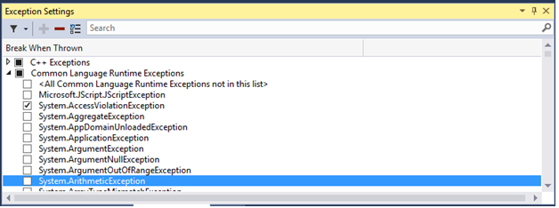
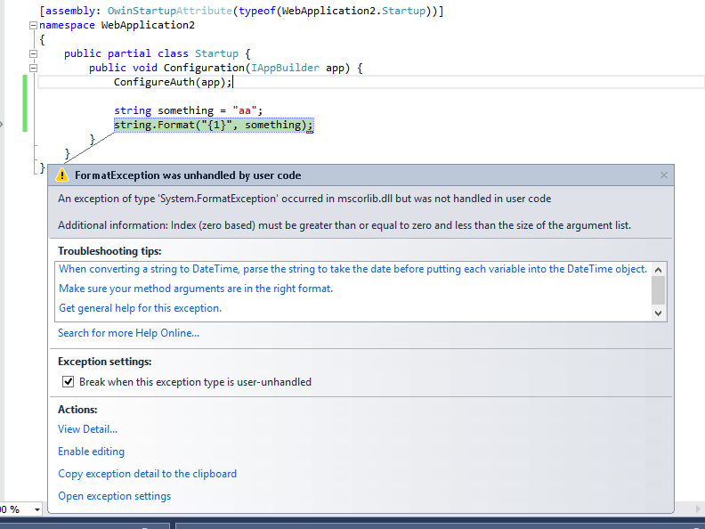
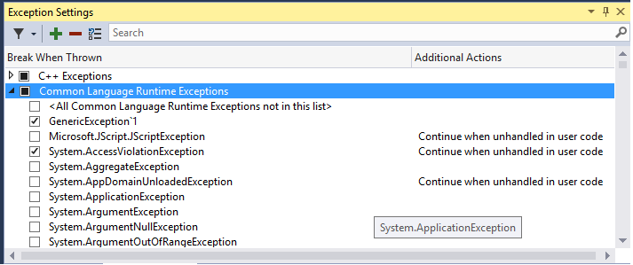

# Managing Exceptions with the Debugger
An exception is an indication of an error state that occurs while a program is being executed. You can and should provide handlers that respond to the most important exceptions, but it’s important to know how to set up the debugger to break for the exceptions you want to see.  
  
 When an exception occurs, the debugger writes an exception message to the Output window. It may break execution in the following cases:  
  
-   when an exception is thrown and is not handled.  
  
-   when the debugger is set to break execution immediately when an exception is thrown, before any handler is invoked.  
  
-   if you have set [Just My Code](../debugger/just-my-code.md), and the debugger is set to break on any exception that is not handled in user code.  
  
> [!NOTE]
>  ASP.NET has a top-level exception handler that shows error pages in a browser. It does not break execution unless **Just My Code** is turned on. For an example, see [Setting the debugger to continue on user-unhandled exceptions](../debugger/managing-exceptions-with-the-debugger.md#BKMK_UserUnhandled) below.  
  
> [!NOTE]
>  In a Visual Basic application, the debugger manages all errors as exceptions, even if you use On Error–style error handlers.  
  
## Managing Exceptions with the Exception Settings Window  
 You can use the **Exception Settings** window to specify which exceptions (or sets of exceptions) will cause the debugger to break, and at which point you want it to break. You can add or delete exceptions, or specify exceptions to break on. Open this window when a solution is open by clicking **Debug / Windows / Exception Settings**.  
  
 You can find specific exceptions by using the **Search** window in the **Exception Settings** toolbar, or use search to filter for specific namespaces (for example **System.IO**).  
  
### Setting the debugger to break when an exception is thrown  
 The debugger can break execution at the point where an exception is thrown, giving you a chance to examine the exception before a handler is invoked.  
  
 In the **Exception Settings** window, expand the node for a category of exceptions (for example, **Common Language Runtime Exceptions**, meaning .NET exceptions), and select the check box for a specific exception within that category (for example **System.AccessViolationException**). You can also select an entire category of exceptions.  
  
   
  
 If you check a given exception, debugger execution will break wherever the exception is thrown, regardless of whether it is handled or unhandled. At this point the exception is called a first chance exception. For example, here are a couple of scenarios:  
  
1.  In the following C# console application, the Main method throws an **AccessViolationException** inside a `try/catch` block:  
  
    ```c#  
    static void Main(string[] args)  
    {  
        try  
        {  
            throw new AccessViolationException();  
            Console.WriteLine("here");  
        }  
        catch (Exception e)  
        {  
            Console.WriteLine("caught exception");  
        }  
        Console.WriteLine("goodbye");  
    }  
    ```  
  
     If you have **AccessViolationException** checked in **Exception Settings**, when you run this code in the debugger execution will break on the `throw` line. You can then continue execution. The console should display both lines:  
  
    ```  
    caught exception  
    goodbye  
    ```  
  
     but it does not display the `here` line.  
  
2.  A C# console application references a class library with a class that has two methods, a method that throws an exception and handles it and a second method that throws the same exception and doesn’t handle it:  
  
    ```vb  
    public class Class1  
    {  
        public void ThrowHandledException()  
        {  
            try  
            {  
                throw new AccessViolationException();  
            }  
            catch (AccessViolationException ave)  
            {  
                Console.WriteLine("caught exception" + ave.Message);  
            }  
        }  
  
        public void ThrowUnhandledException()  
        {  
            throw new AccessViolationException();  
        }  
    }  
    ```  
  
     Here’s the Main() method of the console application:  
  
    ```c#  
    static void Main(string[] args)  
    {  
        Class1 class1 = new Class1();  
        class1.ThrowHandledException();  
        class1.ThrowUnhandledException();  
    }  
    ```  
  
     If you have **AccessViolationException** checked in **Exception Settings**, when you run this code in the debugger execution will break on the `throw` line in both **ThrowHandledException()** and **ThrowUnhandledException()**.  
  
 If you would like to restore the exception settings to the defaults, you can click the **Restore** button on the toolbar:  
  
   
  
###  <a name="BKMK_UserUnhandled"></a> Setting the debugger to continue on user-unhandled exceptions  
 If you are debugging .NET or JavaScript code with [Just My Code](../debugger/just-my-code.md), you can tell the debugger not to break on exceptions that are not handled in user code but are handled somewhere else.  
  
1.  In the **Exception Settings** window, open the context menu by right-clicking in window and then selecting **Show Columns**. (If you have turned off **Just My Code**, you will not see this command.)  
  
2.  You should see a second column named **Additional Actions**. This column displays **Continue when unhandled by user code** on specific exceptions, meaning that the debugger does not break if that exception is not handled in user code but is handled in external code.  
  
3.  You can change this setting either for a particular exception (select the exception, right-click, and select/deselect **Continue when Unhandled in User Code**) or for an entire category of exceptions (for example, all the Common Language Runtime exceptions).  
  
 For example, ASP.NET web applications handle exceptions by converting them to an HTTP 500 status code ([Exception Handling in ASP.NET API](http://www.asp.net/web-api/overview/error-handling/exception-handling)), which may not help you to determine the source of the exception. In the example below, the user code makes a call to `String.Format()` that throws a <xref:System.FormatException>. Execution breaks as follows:  
  
   
  
### Adding and Deleting Exceptions  
 You can add and delete exceptions. You can delete any type of exception from any category by selecting the exception and clicking the **Delete** button (the minus sign) on the **Exception Settings** toolbar, or right-clicking the exception and selecting **Delete** from the context menu. Deleting an exception has the same effect as having the exception unchecked, which is that the debugger will not break when it is thrown.  
  
 To add an exception: in the **Exception Settings** window, select one of the exception categories (for example, **Common Language Runtime**) and click the **Add** button. Type the name of the exception (for example. **System.UriTemplateMatchException**). The exception is added to the list (in alphabetical order), and is automatically checked.  
  
 If you want to add an exception to the GPU Memory Access Exceptions, JavaScript Runtime Exceptions, or Win32 Exceptions categories, you need to include the error code as well as the description.  
  
> [!TIP]
>  Check your spelling! The **Exception Settings** window doesn’t check for the existence of an added exception. So if you type **Sytem.UriTemplateMatchException**, you’ll get an entry for that exception (and not for **System.UriTemplateMatchException**).  
  
 Exception settings are persisted in the solution’s .suo file, so they apply to a particular solution. You can’t reuse specific exception settings across solutions. At this point, only added exceptions are persisted; deleted exceptions are not. In other words, you can add an exception, close and reopen the solution, and the exception will still be there. But if you delete an exception and close/reopen the solution, the exception will reappear.  
  
 The **Exception Settings** window supports generic exception types in C# but not in Visual Basic. To break on exceptions like `MyNamespace.GenericException<T>`, you must add the exception as **MyNamespace.GenericException`1**. That is, if you have created an exception like this:  
  
```c#  
public class GenericException<T> : Exception  
{  
    public GenericException() : base("This is a generic exception.")  
    {  
    }  
}  
```  
  
 You can add the exception to **Exception Settings** like this:  
  
   
  
## See Also  
 [Continuing Execution After an Exception](../debugger/continuing-execution-after-an-exception.md)   
 [How to: Examine System Code After an Exception](../debugger/how-to--examine-system-code-after-an-exception.md)   
 [How to: Use Native Run-Time Checks](../debugger/how-to--use-native-run-time-checks.md)   
 [Using Run-Time Checks Without the C Run-Time Library](../debugger/using-run-time-checks-without-the-c-run-time-library.md)   
 [Exception Assistant](../Topic/Exception%20Assistant.md)   
 [Debugger Basics](../debugger/debugger-basics.md)