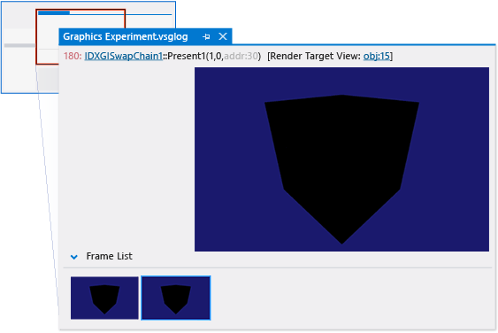
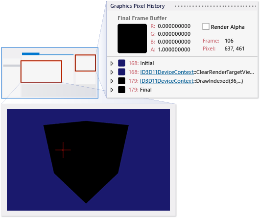
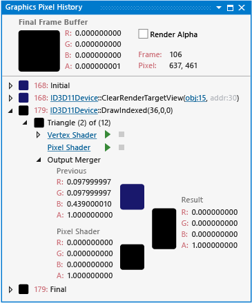
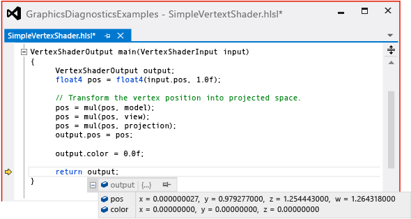
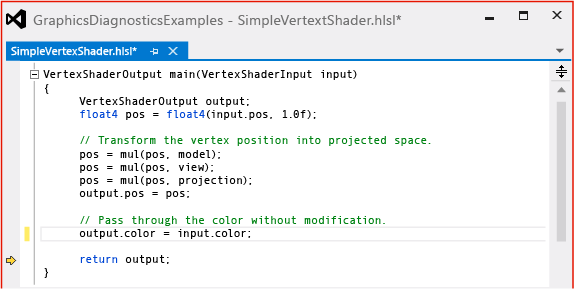
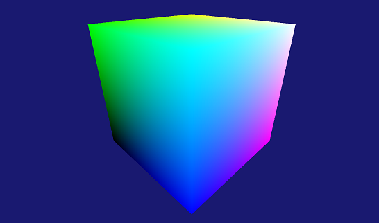

# Walkthrough: Debugging Rendering Errors Due to Shading
This walkthrough demonstrates how to use [!INCLUDE[vsprvs](../code-quality/includes/vsprvs_md.md)] Graphics Diagnostics to investigate an object that is colored incorrectly due to a shader bug.  
  
 This walkthrough demonstrates how to:  
  
-   Examine the graphics log document to identify pixels that show the problem.  
  
-   Use the **Graphics Pixel History** window to examine the pixel state more closely.  
  
-   Use the **HLSL Debugger** to examine the pixel and vertex shaders.  
  
## Scenario  
 Incorrect coloring on objects commonly occurs when a vertex shader passes a pixel shader incorrect or incomplete information.  
  
 In this scenario, you recently added an object to your app, along with new vertex and pixel shaders to transform the object and give it a unique appearance. When you run the app during a test, the object is rendered in solid black. By using Graphics Diagnostics, you capture the problem to a graphics log so that you can debug the app. The problem looks like this in the app:  
  
   
  
## Investigation  
 By using the Graphics Diagnostics tools, you can load the graphics log document to inspect the frames that were captured during the test.  
  
#### To examine a frame in a graphics log  
  
1.  In [!INCLUDE[vsprvs](../code-quality/includes/vsprvs_md.md)], load a graphics log that contains a frame that exhibits the missing model. A new graphics log document window appears in [!INCLUDE[vsprvs](../code-quality/includes/vsprvs_md.md)]. In the top part of this window is the render target output of the selected frame. In the bottom part is the **Frame List**, which displays each captured frame as a thumbnail image.  
  
2.  In the **Frame List**, select a frame in which the object does not have the correct appearance. The render target is updated to reflect the selected frame. In this scenario, the graphics log document window looks like this:  
  
       
  
 After you select a frame that demonstrates the problem, you can use the **Graphics Pixel History** window to diagnose it. The **Graphics Pixel History** window shows the primitives that could have had an effect on a specific pixel, their shaders, and what their effects on the render target were, in chronological order.  
  
#### To examine a pixel  
  
1.  Open the **Graphics Pixel History** window. On the **Graphics Diagnostics** toolbar, choose **Pixel History**.  
  
2.  Select a pixel to examine. On the graphics log document window , select one of the pixels on the object that is incorrectly colored:  
  
       
  
     The **Graphics Pixel History** window is updated to reflect the selected pixel. In this scenario, the **Graphics Pixel History** window looks like this:  
  
       
  
     Notice that the pixel shader's result is fully-opaque black (0, 0, 0, 1), and that the **Output Merger** combined this with the **Previous** color of the pixel in such a way that the **Result** is also fully-opaque black.  
  
 After you examine a pixel that is incorrectly colored and discover that the pixel shader output is not the expected color, you can use the HLSL Debugger to examine the pixel shader and find out what happened to the object's color. You can use the HLSL Debugger to examine the state of HLSL variables during execution, step through the HLSL code, and set breakpoints to help you diagnose the problem.  
  
#### To examine the pixel shader  
  
1.  Start debugging the pixel shader. In the **Graphics Pixel History** window, under the object's primitive, next to **Pixel Shader**, choose the **Start Debugging** button.  
  
2.  In this scenario, because the pixel shader just passes the color through from the vertex shader, it's easy to observe that the pixel shader is not the source of the problem.  
  
3.  Rest the pointer on `input.color`. Notice that its value is fully-opaque black (0, 0, 0, 1).  
  
       
  
     In this scenario, the examination reveals that the incorrect color is probably the result of a vertex shader that does not provide the right color information for the pixel shader to operate on.  
  
 After you've determined that the vertex shader is probably not providing the right information to the pixel shader, the next step is to examine the vertex shader.  
  
#### To examine the vertex shader  
  
1.  Start debugging the vertex shader. In the **Graphics Pixel History** window, under the object's primitive, next to **Vertex Shader**, choose the **Start Debugging** button.  
  
2.  Locate the vertex shader's output structure—this is the input to the pixel shader. In this scenario, the name of this structure is `output`. Examine the vertex shader code and notice that the `color` member of the `output` structure has been explicitly set to fully-opaque black, perhaps as a result of someone's debugging efforts.  
  
3.  Confirm that the color member is never copied from the input structure. Because the value of `output.color` is set to fully-opaque black just before the `output` structure is returned, it’s a good idea to make sure that the value of `output` wasn't correctly initialized on a previous line. Step through the vertex shader code until you reach the line that sets `output.color` to black while you watch the value of `output.color`. Notice that the value of `output.color` isn't initialized until it's set to black. This confirms that the line of code that sets `output.color` to black should be modified, rather than deleted.  
  
       
  
 After you determine that the cause of the rendering issue is that the vertex shader does not provide the correct color value to the pixel shader, you can use this information to fix the problem. In this scenario, you can fix it by changing the following code in the vertex shader  
  
```  
output.color = float3(0.0f, 0.0f, 0.0f);  
```  
  
 to  
  
```hlsl  
output.color = input.color;  
```  
  
 This code just passes the vertex color through from the object's vertices unmodified—more complex vertex shaders could modify the color before passing it through. The corrected vertex shader code should resemble this:  
  
   
  
 After you fix the code, rebuild it and run the app again to discover that the rendering issue is solved.  
  
 