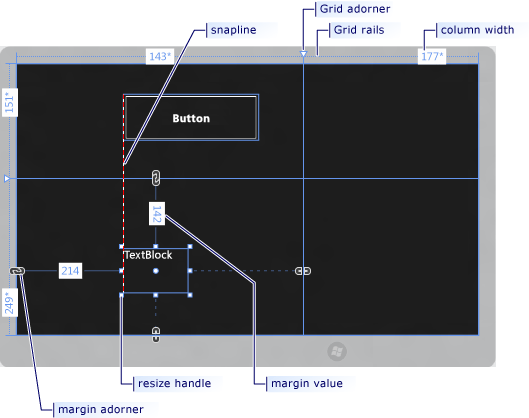
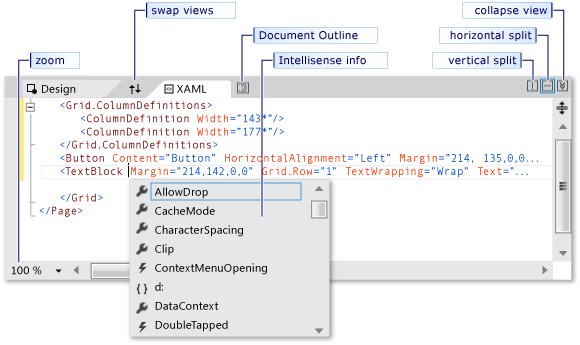
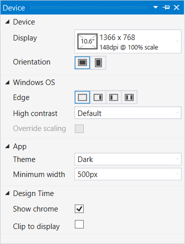
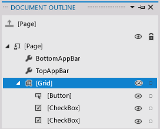
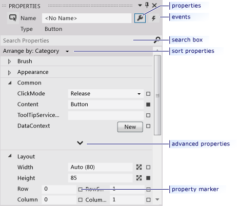

# Creating a UI by using XAML Designer in Visual Studio
The XAML Designer in Visual Studio provides a visual interface to help you design XAML-based Windows Store, Windows Phone, WPF, and Silverlight apps. You can create user interfaces for your apps by dragging controls from the **Toolbox** and setting properties in the **Properties** window. You can also edit XAML directly in XAML view.  
  
 For advanced XAML design tasks such as animations and behaviors, see [Creating a UI by using Blend for Visual Studio](../designers/creating-a-ui-by-using-blend-for-visual-studio.md).  
  
## XAML Designer workspace  
 The workspace in XAML Designer consists of several visual interface elements. These include the artboard, XAML Editor, Device window, Document Outline window, and Properties window. To open the XAML Designer, right-click a XAML file in **Solution Explorer** and choose **View Designer**.  
  
## Authoring views  
 XAML Designer provides a XAML view and a synchronized Design view of your app's rendered XAML markup. With a XAML file open in Visual Studio, you can switch between Design view and XAML view by using the **Design** and **XAML** tabs. You can use the **Swap Panes** button to switch which window appears on top: either the artboard or the XAML Editor.  
  
 In Design view, the window containing the *artboard* is the active window and you can use it as a primary work surface. You can use it to visually design a page in your app by adding or drawing elements, and then by modifying them. For more info, see [Working with elements in XAML Designer](../designers/working-with-elements-in-xaml-designer.md). This illustration shows the artboard in Design view.  
  
   
  
 These features are available in the artboard:  
  
 **Snaplines**  
 Snaplines are *alignment boundaries* that appear as red-dashed lines to show when the edges of controls are aligned, or when text baselines are aligned. Alignment boundaries appear only when **snapping to snaplines** is enabled.  
  
 **Grid rails**  
 `Grid` rails are used to manage rows and columns in a [Grid](http://msdn.microsoft.com/library/windows/apps/windows.ui.xaml.controls.grid.aspx) panel. You can create and delete rows and columns, and you can adjust their relative widths and heights. The vertical Grid rail, which appears on the left of the artboard, is used for rows, and the horizontal line, which appears at the top, is used for columns.  
  
 **Grid adorners**  
 A `Grid` adorner appears as a triangle that has a vertical or horizontal line attached to it on the `Grid` rail. When you drag a `Grid` adorner, the widths or heights of adjacent columns or rows update as you move the mouse.  
  
 `Grid` adorners are used to control the width and height of a `Grid`'s rows and columns. You can add a new column or row by clicking in the `Grid` rails. When you add a new row or column line for a `Grid` panel that has two or more columns or rows, a mini-toolbar appears outside of the rail that enables you to set width and height explicitly. The mini-toolbar enables you to set sizing options for `Grid` rows and columns.  
  
 **Resize handles**  
 Resize handles appear on selected controls and enable you to resize the control. When you resize a control, width and height values typically appear to help you size the control. For more info about manipulating controls in Design view, see [Working with elements in XAML Designer](../designers/working-with-elements-in-xaml-designer.md).  
  
 **Margins**  
 Margins represent the amount of fixed space between the edge of a control and the edge of its container. You can set the margins of a control by using the [Margin](http://msdn.microsoft.com/library/windows/apps/windows.ui.xaml.frameworkelement.margin.aspx) properties under **Layout** in the Properties window.  
  
 **Margin adorners**  
 You can use margin adorners to change the margins of an element relative to its layout container. When a margin adorner is open, a margin is not set and the margin adorner displays a broken chain. When the margin is not set, elements will remain in place when the layout container is resized at run time. When a margin adorner is closed, a margin adorner displays an unbroken chain, and elements will move with the margin as the layout container is resized at run time (the margin remains fixed).  
  
 **Element handles**  
 You can modify an element by using the element handles that appear on the artboard when you move the pointer over the corners of the blue box that surrounds an element. These handles enable you to rotate, resize, flip, move, or add a corner radius to the element. The symbol for the element handle varies by function, and changes depending on the exact location of the pointer. If you don't see the element handles, make sure the element is selected.  
  
 In Design view, additional artboard commands are available in the lower left area of the screen, as shown here:  
  
   
  
 These commands are available on this toolbar:  
  
 **Zoom**  
 Zoom enables you to size the design surface. You can zoom from 12.5% to 800%, or select options such as **Fit to Selection** and **Fit to All**.  
  
 **Show/Hide snap grid**  
 Displays or hides the snap grid that shows the gridlines. Gridlines are used when either **snapping to gridlines** or **snapping to snaplines** is enabled.  
  
 **Turn on/off snapping to gridlines**  
 If **snapping to gridlines** is enabled when you drag an element on the artboard, the element tends to align with the closest horizontal and vertical gridlines.  
  
 **Turn on/off snapping to snaplines**  
 Snaplines help you align controls relative to each other. If **snapping to snaplines** is enabled, when you drag a control relative to other controls, alignment boundaries appear when the edges and the text of some controls are aligned horizontally or vertically. An alignment boundary appears as a red-dashed line.  
  
 In XAML view, the window containing the XAML editor is the active window, and the XAML editor is your primary authoring tool. The Extensible Application Markup Language (XAML) provides a declarative, XML-based vocabulary for specifying an application's user interface. XAML view includes IntelliSense, automatic formatting, syntax highlighting, and tag navigation. This illustration shows XAML view:  
  
   
  
 **Split view bar**  
 The split view bar appears at the top of XAML view when the XAML editor is in the lower window. The split view bar enables you to control the relative sizes of Design view and XAML view. You can also exchange the locations of the views (using the **Swap Panes** button), specify whether the views are arranged horizontally or vertically, and collapse either view.  
  
 **Markup Zoom**  
 Markup zoom enables you to size XAML view. You can zoom from 20% to 400%.  
  
## Device window  
 The Device window in XAML Designer enables you to simulate at design-time various views, displays, and display options for your Windows Store or Windows Phone project. The Device window is available on the **Design** menu when you are working in the XAML Designer. Here's what it looks like:  
  
   
  
 These are the options available in the Device window:  
  
 **Display**  
 Specifies different display sizes and resolutions for the app.  
  
 **Orientation**  
 Specifies different orientations for the app: **Landscape** or **Portrait**.  
  
 **Edge**  
 Specifies different edge alignments for your app: **Both**, **Left**, **Right**, or **None**.  
  
 **High Contrast**  
 Preview the app based on the selected contrast setting. This setting, when set to a value other than **Default**, will override the `RequestedTheme` property set in App.xaml.  
  
 **Override scaling**  
 Turns on and off emulation of document scaling within the design surface. This enables you to increase the scaling percentage by one factor. Select the check box to turn on emulation. For instance, if your scaling percentage is 100%, the document within the design surface will scale up to 140%. This option is disabled if the current scaling percentage is 180.  
  
 **Minimum width**  
 Specifies the minimum width setting. The minimum width can be changed in App.xaml.  
  
 **Theme**  
 Specifies the app theme. For example, you might switch between a Dark and a Light theme.  
  
 **Show chrome**  
 Turns on and off the simulated tablet frame around your app in Design view. Select the check box to show the frame.  
  
 **Clip to display**  
 Specifies the display mode. Select the check box to clip the document size to the display size.  
  
## Document Outline window  
 The Document Outline window in XAML Designer helps you perform these tasks:  
  
-   View the hierarchical structure of all elements on the artboard.  
  
-   Select elements so that you can modify them (move them around in the hierarchy, modify them on the artboard, set their properties in the Properties window, and so on). For more info, see [Working with elements in XAML Designer](../designers/working-with-elements-in-xaml-designer.md)  
  
-   Create and modify templates for elements that are controls.  
  
-   Use the context menu for selected elements. The same menu is also available for selected elements in the artboard.  
  
 To view the Document Outline window, on the menu bar choose **View**, **Other Windows**, **Document Outline**.  
  
   
  
 These are the options available in the Document Outline window:  
  
 **Document Outline**  
 The main view in the Document Outline window displays the hierarchy of a document in a tree structure. You can use the hierarchical nature of the document outline to examine the document at varying levels of detail, and to lock and hide elements singly or in groups.  
  
 **Show/hide**  
 Displays or hides artboard elements that correspond to items in the Document Outline. Use the **Show/hide** buttons, which display a symbol of an eye when shown, or press CTRL+H to hide elements and SHIFT+CTRL+H to display them.  
  
 **Lock/unlock**  
 Locks or unlocks artboard elements that correspond to items in the Document Outline. Locked elements can’t be modified. Use the **Lock/unlock** buttons, which display a padlock symbol when locked, or press CTRL+L to lock elements and SHIFT+CTRL+L to unlock them.  
  
 **Return scope to pageRoot**  
 The option at the top of the Document Outline window, which shows an up arrow symbol, returns the document outline to the previous scope. Scoping up is applicable only when you're in the scope of a style or template.  
  
## Properties window  
 The Properties window enables you to set property values on controls. Here's what it looks like:  
  
   
  
 There are various options at the top of the Properties window. You can change the name of the currently selected element by using the **Name** box. In the upper-left corner, there's an icon that represents the currently selected element. To arrange the properties by category or alphabetically, click **Category**, **Name**, or **Source** in the **Arrange by** list. To see the list of events for a control, click the **Events** button, which displays a lightning bolt symbol. To search for a property, start to type the name of the property in the **Search Properties** box. The Properties window displays the properties that match your search as you type. Some properties allow you to set advanced properties by selecting a down arrow button. For more info on using properties and handling events, see [Quickstart: adding controls and handling events](http://go.microsoft.com/fwlink/?LinkID=247983)  
  
 To the right of each property value is a *property marker* that appears as a box symbol. The appearance of the property marker indicates whether there's a data binding or a resource applied to the property. For example, a white box symbol indicates a default value, a black box symbol typically indicates that a local resource has been applied, and an orange box typically indicates a data binding has been applied. When you click the property marker, you can navigate to the definition of a style, open the data binding builder, or open the resource picker.  
  
## See Also  
 [Working with elements in XAML Designer](../designers/working-with-elements-in-xaml-designer.md)   
 [How to create and apply a resource](../designers/how-to-create-and-apply-a-resource.md)   
 [Walkthrough: Binding to data in XAML Designer](../designers/walkthrough--binding-to-data-in-xaml-designer.md)