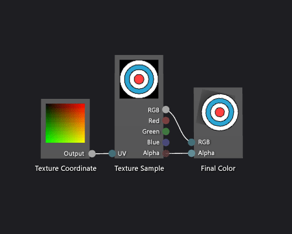

# How to: Create a Basic Texture Shader
[!INCLUDE[vs2017banner](../code-quality/includes/vs2017banner.md)]

This document demonstrates how to use the Shader Designer and the Directed Graph Shader Language (DGSL) to create a single-texture shader. This shader sets the final color directly to the RGB and alpha values that are sampled from the texture.  
  
 This document demonstrates these activities:  
  
-   Removing nodes from a shader graph  
  
-   Adding nodes to a graph  
  
-   Setting shader parameters  
  
-   Setting parameter visibility  
  
-   Connecting nodes  
  
## Creating a basic texture shader  
 You can implement a basic, single-texture shader by writing the color and alpha values of a texture sample directly to the final output color.  
  
 Before you begin, make sure that the **Properties** window and the **Toolbox** are displayed.  
  
#### To create a basic texture shader  
  
1.  Create a DGSL shader to work with. For information about how to add a DGSL shader to your project, see the Getting Started section in [Shader Designer](../designers/shader-designer.md).  
  
2.  Delete the **Point Color** node. In **Select** mode, select the **Point Color** node, and then on the menu bar, choose **Edit**, **Delete**. This makes room for the node that's added in the next step.  
  
3.  Add a **Texture Sample** node to the graph. In the **Toolbox**, under **Texture**, select **Texture Sample** and move it to the design surface.  
  
4.  Add a **Texture Coordinate** node to the graph. In the **Toolbox**, under **Texture**, select **Texture Coordinate** and move it to the design surface.  
  
5.  Choose a texture to apply. In **Select** mode, select the **Texture Sample** node, and then in the **Properties** window, specify the texture that you want to use by using the **Filename** property.  
  
6.  Make the texture publicly accessible. Select the **Texture Sample** node, and then in the **Properties** window, set the **Access** property to **Public**. Now you can set the texture from another tool, such as the **Model Editor**.  
  
7.  Connect the texture coordinates to the texture sample. In **Select** mode, move the **Output** terminal of the **Texture Coordinate** node to the **UV** terminal of the **Texture Sample** node. This connection samples the texture at the specified coordinates.  
  
8.  Connect the texture sample to the final color. Move the **RGB** terminal of the **Texture Sample** node to the **RGB** terminal of the **Final Color** node, and then move the **Alpha** terminal of the **Texture Sample** node to the **Alpha** terminal of the **Final Color** node.  
  
 The following illustration shows the completed shader graph and a preview of the shader applied to a cube.  
  
> [!NOTE]
>  In this illustration, a plane is used as the preview shape, and a texture has been specified to better demonstrate the effect of the shader.  
  
   
  
 Certain shapes might provide better previews for some shaders. For more information about how to preview shaders in the Shader Designer, see [Shader Designer](../designers/shader-designer.md)  
  
## See Also  
 [How to: Apply a Shader to a 3-D Model](../designers/how-to--apply-a-shader-to-a-3-d-model.md)   
 [Image Editor](../designers/image-editor.md)   
 [Shader Designer](../designers/shader-designer.md)   
 [Shader Designer Nodes](../designers/shader-designer-nodes.md)