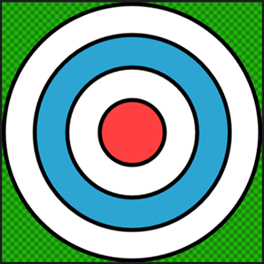
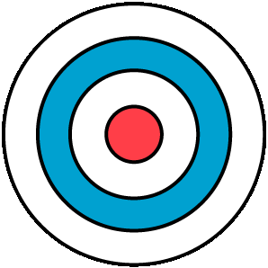

# How to: Create a Basic Texture
This document demonstrates how to use the Image Editor to create a basic texture.  
  
 This document demonstrates these activities:  
  
-   Setting the size of the texture  
  
-   Setting the foreground and background colors  
  
-   Using the alpha channel (transparency)  
  
-   Using the **Fill** and **Ellipse** tools  
  
-   Setting tool properties  
  
## Creating a basic texture  
 You can use the Image Editor to create and modify images and textures for your game or app.  
  
 The following steps show how to create a texture that represents a "bullseye" target.When you are finished, the texture should look like the following picture. To better demonstrate the transparency in the texture, the Image Editor has been configured to use a green, checkered pattern to display it.  
  
   
  
 Before you begin, make sure that the **Properties** window is displayed. You use the **Properties** window to set the image size, change tool properties, and specify colors while you work.  
  
#### To create a "bullseye" target texture  
  
1.  Create a texture to work with. For information about how to add a texture to your project, see the Getting Started section in [Image Editor](../designers/image-editor.md).  
  
2.  Set the image size to 512x512 pixels. In the **Properties** window, set the values of the **Width** and **Height** properties to `512`.  
  
3.  On the Image Editor toolbar, choose the **Fill** tool. The **Properties** window now displays the properties of the **Fill** tool together with the image properties.  
  
4.  Set the foreground color to fully-transparent black. In the **Properties** window, in the **Colors** property group, select **Foreground**. Set the values of the **R**, **G**, **B**, and **A** properties next to the color picker to `0`.  
  
5.  On the Image Editor toolbar, choose the **Fill** tool, and then press and hold the Shift key and choose any point in the image. Using the Shift key causes the alpha value of the fill color to replace the color in the image; otherwise, the alpha value is used to blend the fill color together with the color in the image.  
  
    > [!IMPORTANT]
    >  This step, together with the color selection in the previous step, ensures that the base image is prepared for the "bullseye" target texture that you will draw. When the image is filled with transparent black—and because the border of the target is black—there will be no aliasing artifacts around the target.  
  
6.  On the Image Editor toolbar, choose the **Ellipse** tool.  
  
7.  Set the foreground color to fully-opaque black. Set the values of the **R**, **G**, and **B** properties to `0` and the value of the **A** property to `255`.  
  
8.  Set the background color to fully-opaque white. In the **Properties** window, in the **Colors** property group, select **Background**. Set the values of the **R**, **G**, **B**, and **A** properties to `255`.  
  
9. Set the width of the outline of the ellipse. In the **Properties** window, in the **Appearance** property group, set the value of the **Width** property to `8`.  
  
10. Make sure that anti-aliasing is enabled. In the **Properties** window, in the **Appearance** property group, make sure that the **Anti-alias** property is set.  
  
11. Using the **Ellipse** tool, draw a circle from pixel coordinate `(3, 3)` to pixel coordinate `(508, 508)`. To draw the circle more easily, you can press and hold the Shift key while you draw.  
  
    > [!NOTE]
    >  The pixel coordinates of the current pointer location are displayed on the [!INCLUDE[vsprvs](../code-quality/includes/vsprvs_md.md)] status bar.  
  
12. Change the background color. Set **R** to `44`, **G** to `165`, **B** to `211`, and **A** to `255`.  
  
13. Draw another circle from pixel coordinate `(64, 64)` to pixel coordinate `(448, 448)`.  
  
14. Change the background color back to fully-opaque white. Set **R**, **G**, **B**, and **A** to `255`.  
  
15. Draw another circle from pixel coordinate `(128, 128)` to pixel coordinate `(384, 384)`.  
  
16. Change the background color. Set **R** to `255`, **G** and **B** to `64`, and **A** to `255`.  
  
17. Draw another circle from pixel coordinate `(192, 192)` to pixel coordinate `(320, 320)`.  
  
 The "bullseye" target texture is complete. Here's the final image, shown with transparency.  
  
   
  
 As a next step, you can generate MIP levels for this texture. For information, see [How to: Create and Modify MIP Levels](../designers/how-to--create-and-modify-mip-levels.md).  
  
## See Also  
 [Image Editor](../designers/image-editor.md)