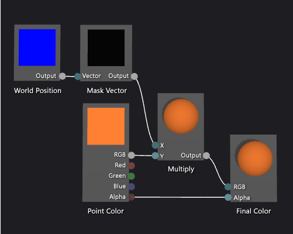

# How to: Create a Geometry-Based Gradient Shader
[!INCLUDE[vs2017banner](../code-quality/includes/vs2017banner.md)]

This document demonstrates how to use the Shader Designer and the Directed Graph Shader Language to create a geometry-based gradient shader. This shader scales a constant RGB color value by the height of each point of an object in world space.  
  
 This document demonstrates these activities:  
  
-   Adding nodes to a shader graph  
  
-   Setting node properties  
  
-   Disconnecting nodes  
  
-   Connecting nodes  
  
## Creating a geometry-based gradient shader  
 You can implement a geometry-based shader by incorporating the position of the pixel into your shader. In shading languages, a pixel contains more information than just its color and location on a 2-D screen. A pixel—known as a *fragment* in some systems—is a collection of values that describe the surface that corresponds to a pixel. The shader that's described in this document utilizes the height of each pixel of a 3-D object in world space to affect the final output color of the fragment.  
  
 Before you begin, make sure that the **Properties** window and the **Toolbox** are displayed.  
  
#### To create a geometry-based gradient shader  
  
1.  Create a DGSL shader to work with. For information about how to add a DGSL shader to your project, see the Getting Started section in [Shader Designer](../designers/shader-designer.md).  
  
2.  Disconnect the **Point Color** node from the **Final Color** node. Choose the **RGB** terminal of the **Point Color** node, and then choose **Break Links**. This makes room for the node that's added in the next step.  
  
3.  Add a **Multiply** node to the graph. In the **Toolbox**, under **Math**, select **Multiply** and move it to the design surface.  
  
4.  Add a **Mask Vector** node to the graph. In the **Toolbox**, under **Utility**, select **Mask Vector** and move it to the design surface.  
  
5.  Specify mask values for the **Mask Vector** node. In **Select** mode, select the **Mask Vector** node, and then in the **Properties** window, set the **Green / Y** property to **True**, and then set the **Red / X**, **Blue / Z** and **Alpha / W** properties to **False**. In this example, the **Red / X**, **Green / Y**, and **Blue / Z** properties correspond to the x, y, and z components of the **World Position** node, and **Alpha / W** is unused. Because only **Green / Y** is set to **True**, only the y component of the input vector remains after it is masked.  
  
6.  Add a **World Position** node to the graph. In the **Toolbox**, under **Constants**, select **World Position** and move it to the design surface.  
  
7.  Mask the world space position of the fragment. In **Select** mode, move the **Output** terminal of the **World Position** node to the **Vector** terminal of the **Mask Vector** node. This connection masks the position of the fragment to ignore the x and z components.  
  
8.  Multiply the RGB color constant by the masked world space position. Move the **RGB** terminal of the **Point Color** node to the **Y** terminal of the **Multiply** node, and then move the **Output** terminal of the **Mask Vector** node to the **X** terminal of the **Multiply** node. This connection scales the color value by the height of the pixel in world space.  
  
9. Connect the scaled color value to the final color. Move the **Output** terminal of the **Multiply** node to the **RGB** terminal of the **Final Color** node.  
  
 The following illustration shows the completed shader graph and a preview of the shader applied to a sphere.  
  
> [!NOTE]
>  In this illustration, an orange color is specified to better demonstrate the effect of the shader, but because the preview shape has no position in world-space, the shader cannot be fully previewed in the Shader Designer. The shader must be previewed in a real scene to demonstrate the full effect.  
  
   
  
 Certain shapes might provide better previews for some shaders. For information about how to preview shaders in the Shader Designer, see **Previewing shaders** in [Shader Designer](../designers/shader-designer.md)  
  
 The following illustration shows the shader that's described in this document applied to the 3-D scene that's demonstrated in [How to: Model 3-D Terrain](../designers/how-to--model-3-d-terrain.md). The intensity of the color increases with the height of the point in the world.  
  
   
  
 For more information about how to apply a shader to a 3-D model, see [How to: Apply a Shader to a 3-D Model](../designers/how-to--apply-a-shader-to-a-3-d-model.md).  
  
## See Also  
 [How to: Apply a Shader to a 3-D Model](../designers/how-to--apply-a-shader-to-a-3-d-model.md)   
 [How to: Export a Shader](../designers/how-to--export-a-shader.md)   
 [How to: Model 3-D Terrain](../designers/how-to--model-3-d-terrain.md)   
 [How to: Create a Grayscale Texture Shader](../designers/how-to--create-a-grayscale-texture-shader.md)   
 [Shader Designer](../designers/shader-designer.md)   
 [Shader Designer Nodes](../designers/shader-designer-nodes.md)