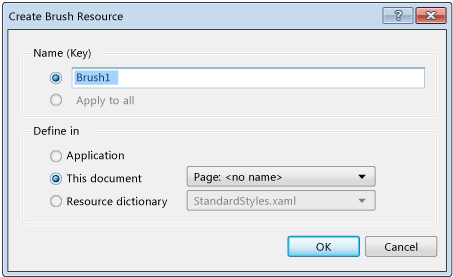

# How to create and apply a resource
Styles and templates for elements in the XAML Designer are stored in reusable entities called resources. Styles enable you to set element properties and reuse those settings for a consistent appearance across multiple elements. A [ControlTemplate](http://msdn.microsoft.com/library/windows/apps/windows.ui.xaml.controls.controltemplate.aspx) defines the appearance of a control and can also be applied as a resource. For more info, see [Quickstart: styling controls](http://go.microsoft.com/fwlink/?LinkID=248239) and [QuickStart: control templates](http://go.microsoft.com/fwlink/?LinkID=247982).  
  
 Whenever you create a new resource from an existing property, [Style](http://msdn.microsoft.com/library/windows/apps/windows.ui.xaml.style.aspx), or `ControlTemplate`, the **Create Resource** dialog box enables you to define the resource at the application level, the document level, or the element level. These levels determine where you can use the resource. For example, if you define the resource at the element level, the resource can be applied only to the element on which you created it. You can also choose to store the resource in a resource dictionary, which is a separate file that you can use again in another project.  
  
### To create a new resource  
  
1.  With a XAML file open in XAML Designer, create an element, or choose an element in the Document Outline window.  
  
2.  In the Properties window, choose the property marker, which appears as a box symbol to the right of a property value, and then choose **Convert to New Resource**. A white box symbol indicates a default value, and a black box symbol typically indicates that a local resource has been applied  
  
     The appropriate dialog box for creating a resource appears. This dialog box appears when you create a resource from a brush:  
  
       
  
3.  In the **Name (Key)** box, enter a key name. This is the name that you can use when you want other elements to reference the resource.  
  
4.  Under **Define in**, choose the option that specifies where you want the resource to be defined:  
  
    -   To make the resource available to any document in your application, choose **Application**.  
  
    -   To make the resource available to only the current document, choose **This document**.  
  
    -   To make the resource available to only the element from which you created the resource or to its child elements, choose **This document**, and in the drop-down list, select *element*: *name*.  
  
    -   To define the resource in a resource dictionary file that can be reused in other projects, click **Resource dictionary**, and then select an existing resource dictionary file, such as **StandardStyles.xaml**, in the drop-down list.  
  
5.  Choose the **OK** button to create the resource and apply it to the element from which you created it.  
  
### To apply a resource to an element or property  
  
1.  In the Document Outline window, choose the element that you want to apply a resource to.  
  
2.  Do one of the following:  
  
    -   Apply a resource to a property. In the Properties window, choose the property marker next to the property value, choose **Local Resource** or **System Resource**, and then choose an available resource from the list that appears.  
  
         If you don't see a resource that you expect to see, it might be because the type of the resource doesn’t match the type of the property.  
  
    -   Apply a style or control template resource to a control. Open the context menu for a control in the Document Outline window, choose **Edit Template** or **Edit Additional Templates**, choose **Apply Resource**, and then choose the name of the control template from the list that appears.  
  
        > [!NOTE]
        >  **Edit Template** is used to apply control templates. **Edit Additional Templates** is used to apply other template types.  
  
     Resources can be applied wherever they're compatible. For example, a brush resource can be applied to the **Foreground** property of a \<xref:Windows.UI.Xaml.Controls.TextBox> control.  
  
### To edit a resource  
  
1.  Choose an element on the artboard or in the Document Outline window.  
  
2.  Choose the Default or Local property marker to the right of the property in the Properties window, and then choose **Edit Resource** to open the **Edit Resource** dialog box.  
  
3.  Modify options for the resource.  
  
## See Also  
 [Creating a UI by using XAML Designer](../designers/creating-a-ui-by-using-xaml-designer-in-visual-studio.md)