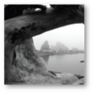
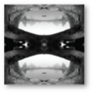
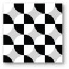
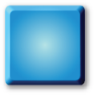
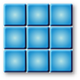
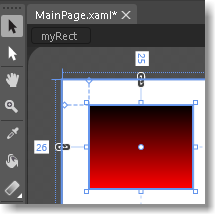
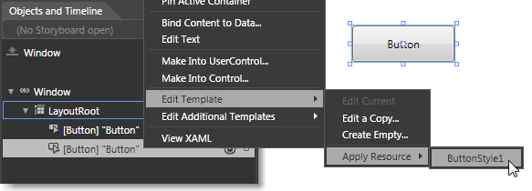
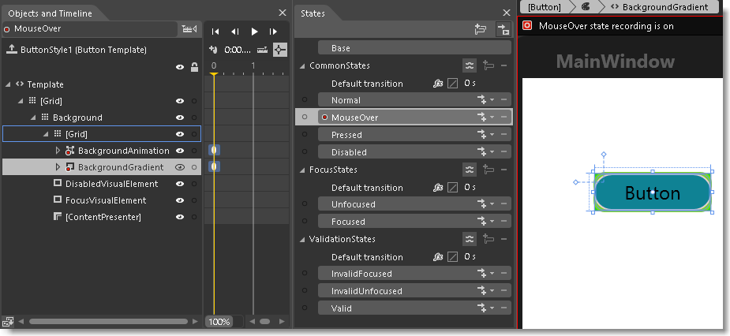
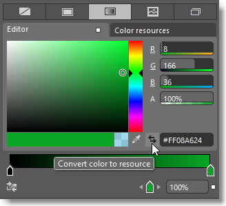

# Modify the style of objects in Blend
The easiest way to customize an object is to set properties in the **Properties** pane.  
  
 If you want re-use settings or groups of settings, create a re-usable resource. This could be a *style*, *template*, or something simple like a custom color. You can also make a control appear differently based on its state. For example, a button turns green when the user clicks it.  
  
 **In this topic**:  
  
-   [Brushes: Modify the appearance of an object](#Brushes)  
  
-   [Styles and Templates: Create a consistent look and feel across controls](#Styles)  
  
-   [Visual States: Change the appearance of a control based on its state](#Visual)  
  
-   [Resources: Create colors, styles, and templates and reuse them later](#Resources)  
  
##   Brushes: Modify the appearance of an object  
 Apply a brush to an object if you want to change its appearance.  
  
 **Watch a short video:**  [Brushes Editor](http://www.popscreen.com/v/6A4mO/Microsoft-Expression-Blend-The-Brushes-Editor).  
  
### Paint a repeating image or pattern on an object  
 Paint a repeating image or pattern on an object by using a *tile brush*.  
  
 To create a tile brush, you begin by creating an *image brush*, *drawing brush*, or *visual brush* resource.  
  
 Create an image brush by using an image. The following illustrations show the image brush, the image brush tiled, and the image brush flipped.  
  
     
  
 Create a drawing brush by using a vector drawing such as a path or shape. The following illustrations show the drawing brush, the drawing brush tiled, and the drawing brush flipped.  
  
     
  
 Create a visual brush from a control such as a button. The following illustrations show the visual brush, and the visual brush tiled.  
  
    
  
 **Watch a short video:**  [Tile Brushes](http://www.popscreen.com/v/6A4iM/Microsoft-Expression-Blend-Tile-Brushes).  
  
##   Styles and Templates: Create a consistent look and feel across controls  
 You can design the appearance and behavior of a control one time and apply that design to other controls so that you don’t have to maintain them individually.  
  
 **Should you use a style?**: If you just want to set default properties (such as the color of a button), use a *style*. You can modify a control even after you’ve applied a style to it.  
  
 **Should you use a template?**: If you want to change the structure of a control, use a *template*. Imagine converting a graphic or logo to a button. You can’t modify a control after you’ve applied a template to it.  
  
### Create a template or style  
 There’s two ways to create a template. You can convert any object on your artboard to a control or you can base your template on an existing control.  
  
 To convert any object to a control template, select the object, and then on the **Tools** menu, choose **Make Into Control**.  
  
 If you want to base your template on an existing control, select an object on the artboard. Then, at the top of the artboard, choose the breadcrumb button, choose **Edit Template**, and then choose **Edit a Copy** or **Create Empty**.  
  
   
  
 To create a style, select the object, and then in the **Object** menu, choose **Edit Style**, and then choose **Edit a Copy** or **Create Empty**.  
  
-   Choose **Edit a Copy** to start with the default style or template of the control.  
  
-   Choose **Create Empty** to start from scratch.  
  
 The **Edit Current** option appears only if you edit a style or template that you’ve already created. It won’t appear for a control that is still using a default system template.  
  
 In the **Create Style Resource** dialog box, you can either name the style or template so that you can use it later, or you can apply the style or template to all controls of that type.  
  
   
  
> [!NOTE]
>  You can’t create styles or templates for every type of control. If a control doesn’t support them, the breadcrumb button won’t appear above the artboard.  
>   
>  To return to the editing scope of your main document, click **Return scope to** .  
>   
>    
  
 **Watch a short video:**  [Create a style](http://www.microsoft.com/showcase/details.aspx?uuid=9b8e86e2-8e90-4d61-81af-fa5b5afb3e95).  
  
 **Watch a short video:**  [Creating a Control Template in Expression Blend](http://msdn.microsoft.com/expression/cc263912.aspx).  
  
### Apply a style or template to a control  
 Right-click an object in the [Objects and Timeline](assetId:///135a5a5e-ec6d-4f38-8827-60e284cd5f57#Objects) panel, choose **Edit Template**, and then choose **Apply Resource**.  
  
   
  
### Restore the default style or template of a control  
 Select the control, and in the [Properties](assetId:///135a5a5e-ec6d-4f38-8827-60e284cd5f57#Properties) panel, locate the **Style** or **Template** property. Then, click **Advanced options** , and then click **Reset** on the shortcut menu.  
  
##   Visual States: Change the appearance of a control based on its state  
 Controls can have different visual appearances based on user interactions. For example, you can make a button turn green when a user clicks it or you could run an animation. You shorten or lengthen the time between visual states by using transitions.  
  
   
  
 **Watch a short video:**  [Manage the state of your WPF controls](https://www.youtube.com/watch?v=m0PlkF5i6uw).  
  
##   Resources: Create colors, styles, and templates and reuse them later  
 You can convert just about anything in your project to a resource. A resource is just an object that you can reuse in different places in your application. For example, you can create a color one time, make it a resource, and then use that color on several objects. To change the color of all of those objects, just change the color resource.  
  
    
  
 **Watch a short video:**  [A brief touch on resources](http://www.popscreen.com/v/6A4k7/Microsoft-Expression-Blend-Brief-Touch-on-Resources).  
  
## See Also  
 [Creating a UI by using Blend for Visual Studio](../designers/creating-a-ui-by-using-blend-for-visual-studio.md)