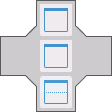
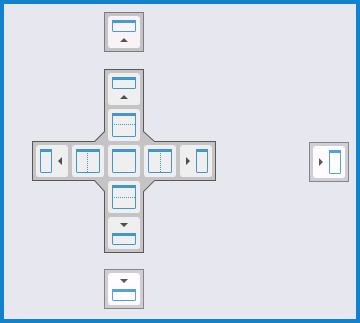
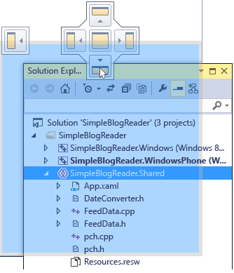
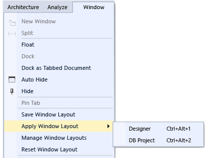
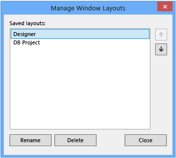

# Customizing window layouts in Visual Studio
In Visual Studio you can customize the position, size and behavior of windows to create window layouts that work best for various development workflows. When you customize the layout, the IDE remembers it. For example, if you change the docking location of **Solution Explorer** and then close Visual Studio, the next time that you start, even if you are working on another computer, **Solution Explorer** will be docked in that same location. You can also give a custom layout a name and save it, and then switch between layouts with a single command. For example you could create a layout for editing, and another for debugging, and switch between them by using the **Window &#124; Apply Window Layout** menu command.  
  
## Kinds of Windows  
  
### Tool and Document Windows  
 The IDE has two basic window types, *tool windows* and *document windows*. Tool windows include Solution Explorer, Server Explorer, Output Window, Error List, the designers, the debugger windows, and so on. Document windows contain source code files, arbitrary text files, config files, and so on. Tool windows can be resized and dragged by their title bar. Document windows can be dragged by their tab. Right-click on the tab or title bar to set other options on the window.  
  
 The **Window** menu shows options for docking, floating and hiding windows in the IDE. Right click on a window tab or title bar to see additional options for that specific window. You can display more than one instance of certain tool windows at a time. For example, you can display more than one web browser window, and you can create additional instances of some tool windows by choosing **New Window** on the **Window** menu.  
  
### Preview tab (document windows)  
 In the Preview tab, you can view files in the editor without opening them. You can preview files by choosing them in **Solution Explorer**, during debugging when you step into files, with Go to Definition, and when you browse through results of a search. Preview files appear in a tab on the right side of the document tab well. The file opens for editing if you modify it or choose the **Open**.  
  
### Tab Groups  
 Tab Groups extend your ability to manage limited workspace while you are working with two or more open documents in the IDE. You can organize multiple document windows and tool windows into either vertical or horizontal Tab Groups and shuffle documents from one Tab Group to another.  
  
### Split Windows  
 When you have to view or edit two locations at once in a document, you can split windows. To divide your document into two independently scrolling sections, click **Split** on the **Window** menu. Click **Remove Split** on the **Window** menu to restore the single view.  
  
### Toolbars  
 Toolbars can be arranged by dragging, or by using the **Customize** dialog box. For more information about how to position and customize toolbars, see [How to: Customize Menus and Toolbars](../ide/how-to--customize-menus-and-toolbars-in-visual-studio.md).  
  
## Arranging and Docking Windows  
 Both document windows and tool windows can be *docked*, so that it has a position and size within the IDE window frame, or floating as a separate window independent of the IDE. Tool windows can be docked anywhere inside the IDE frame; some tool windows can be docked as tabbed windows in the editor frame. Document windows can be docked within the editor frame, and they can be pinned to their current position in the tab order. You can dock multiple windows to float together in a “raft” over or outside of the IDE. Tool windows can also be hidden or minimized.  
  
 You can arrange windows in the following ways:  
  
-   Pin document windows to the left of the tab well.  
  
-   Tab-dock windows to the editing frame.  
  
-   Dock tool windows to the edge of a frame in the IDE.  
  
-   Float document or tool windows over or outside the IDE.  
  
-   Hide tool windows along the edge of the IDE.  
  
-   Display windows on different monitors.  
  
-   Reset window placement to the default layout or to a saved custom layout.  
  
 Tool and document windows can be arranged by dragging, by using commands on the **Window** menu, and by right-clicking the title bar of the window to be arranged.  
  
> [!NOTE]
>  Your computer might show different names or locations for some of the Visual Studio user interface elements in the following instructions. The Visual Studio edition that you have and the settings that you use determine these elements. For more information, see [Customizing Development Settings in Visual Studio](http://msdn.microsoft.com/en-us/22c4debb-4e31-47a8-8f19-16f328d7dcd3).  
  
### Docking Windows  
 When you click and drag the title bar of a tool window, or the tab of document window, a guide diamond appears. During the drag operation, when the mouse cursor is over one of the arrows in the diamond, a shaded area will appear that shows you where the window will be docked if you release the mouse button now.  
  
 To move a dockable window without snapping it into place, choose the Ctrl key while you drag the window.  
  
 To return a tool window or document window to its most recent docked location, press **CTRL** while you double-click the title bar or tab of the window.  
  
 The following illustration shows the guide diamond for document windows, which can only be docked within the editing frame:  
  
   
  
 Tool windows can be fastened to one side of a frame in the IDE or within the editing frame. A guide diamond appears when you drag a tool window to another location to help you to easily re-dock the window.  
  
 Guide diamond for tool windows  
  
   
  
 The following illustration shows Solution Explorer being docked in a new location, which is shown by the blue shaded area:  
  
   
  
### Closing and auto-hiding tool windows  
 You can close a tool window by clicking the X in the upper right of the title bar; to reopen the window, use its keyboard shortcut or menu command. Tool windows support a feature named Auto Hide, which causes a window to slide out of the way when you use a different window. When a window is auto-hidden, its name appears on a tab at the edge of the IDE. To use the window again, point to the tab so that the window slides back into view.  
  
   
  
> [!NOTE]
>  To set whether Auto Hide operates on tool windows individually or as docked groups, select or clear **Auto Hide button affects active tool windows only** in the **Options** dialog box. For more information, see [General, Environment, Options Dialog Box](../reference/general--environment--options-dialog-box.md).  
  
> [!NOTE]
>  Tool windows that have Auto Hide enabled may temporarily slide into view when the window has focus. To hide the window again, select an item outside of the current window. When the window loses focus, it slides back out of view.  
  
### Specifying a Monitor  
 If you have a second monitor and your operating system supports it, you can choose which monitor displays a window. You can even group multiple windows together in “rafts” on other monitors.  
  
> [!TIP]
>  You can create multiple instances of **Solution Explorer** and move them to another monitor. Right-click the window and choose **New Solution Explorer View**. You can return all windows back to the original monitor by double-clicking while choosing the Ctrl key.  
  
### Reset, name, and switch between window layouts  
 You can return the IDE to the original window layout for your settings collection by using the **Reset Window Layout** command. When you run this command, the following actions occur:  
  
-   All windows are moved to their default positions.  
  
-   Windows that are closed in the default window layout are closed.  
  
-   Windows that are open in the default window layout are opened.  
  
### Create and save custom layouts  
 Visual Studio 2015 enables you to save up to 10 custom window layouts and quickly switch between them. The following steps show how to create, save, invoke, and manage custom layouts that take advantage of multiple monitors with both docked and floating tool windows.  
  
 First, create a test solution that has two projects, each with a different optimal layout.  
  
##### Create a UI project and customize the layout  
  
1.  In the **New Project** dialog, create a Visual C# WPF Desktop Application and call it whatever you like. Pretend that this is the project where we’ll be working on the user interface, so we want to maximize the space for the designer window and move other tool windows out of the way.  
  
2.  If you have multiple monitors, pull the **Solution Explorer** window and the **Properties** window over to your second monitor. On a single monitor system, try closing all the windows except the designer.  
  
3.  Press **Ctrl + Alt + X** to display the Toolbox. If the window is docked, drag it so that it floats somewhere where you’d like to position it, on either monitor.  
  
4.  Press F5 to put Visual Studio into debugging mode. Adjust the position of the Autos, Call Stack and Output debugging windows the way you want them. The layout you are about to create will apply to both editing mode and debugging mode.  
  
5.  When your layouts in both debugging mode and editing mode are how you want them, from the main menu choose **Window > Save Window Layout**. Call this layout “Designer.”  
  
     Note that your new layout is assigned the next Keyboard shortcut from the reserved list of Ctrl + Alt + 1...0.  
  
##### Create a database project and layout  
  
1.  Add a new **SQL Server Database** project to the solution.  
  
2.  Right-click on the new project in Solution Explorer and choose **View in Object Explorer**. This displays the **SQL Server Object Explorer** window, which enables you to access tables, views and other objects in your database. You can either float this window or leave it docked. Adjust the other tool windows the way you want them. For added realism, you can add an actual database, but it’s not necessary for this walkthrough.  
  
3.  When your layout is how you want it, from the main menu choose **Window > Save Window Layout**. Call this layout “DB Project.” (We won’t bother with a debug mode layout for this project.)  
  
##### Switch between the layouts  
  
1.  To switch between layouts, use the Keyboard shortcuts, or from the main menu choose **Window > Apply Window Layout**.  
  
       
  
     After applying the UI layout, note how the layout is preserved both in editing mode and in debug mode.  
  
     If you have a multi monitor setup at work and a single monitor laptop at home, you can create layouts that are optimized for each machine.  
  
     Note: If you apply a multi-monitor layout on a single-monitor system, the floating windows that you placed on the second monitor will now be hidden behind the Visual Studio window. You can bring these windows to the front by pressing Alt + Tab. If you later open Visual Studio with multiple monitors, you can restore the windows to their specified positions by re-applying the layout.  
  
##### Manage and roam your layouts  
  
1.  You can remove, rename or reorder your custom layout by choosing **Window > Manage Window Layouts**. If you move a layout, the key binding is automatically adjusted to reflect the new position in the list. The bindings cannot be otherwise modified, and so you can store a maximum of 10 layouts at a time.  
  
       
  
     To remind yourself which keyboard shortcut is assigned to which layout, choose **Window > Apply Window Layout**.  
  
     These layouts automatically roam between Visual Studio editions, and also between Blend instances on separate machines, and from any Express edition to any other Express organization. However, layouts do not roam across Visual Studio, Blend and Express.  
  
## Related Topics  
  
|Title|Description|  
|-----------|-----------------|  
|[Kinds of Windows](../misc/kinds-of-windows.md)|Discusses the differences between tool windows and document windows in the IDE.|  
|[How to: Arrange and Dock Windows](../misc/how-to--arrange-and-dock-windows.md)|Describes how to dock, auto hide, and tile windows, and also how to reset the window layout.|  
|[How to: Move Around in the IDE](../ide/how-to--move-around-in-the-visual-studio-ide.md)|Describes how you can cycle through open windows in the IDE, by order of usage. Also describes how you can jump to specific documents.|  
|[Customizing Development Settings in Visual Studio](http://msdn.microsoft.com/en-us/22c4debb-4e31-47a8-8f19-16f328d7dcd3)|Contains information about settings combinations and how settings affect window layouts, keyboard shortcuts, and other elements in the IDE.|