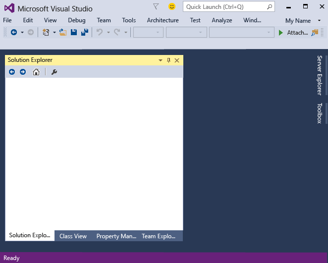
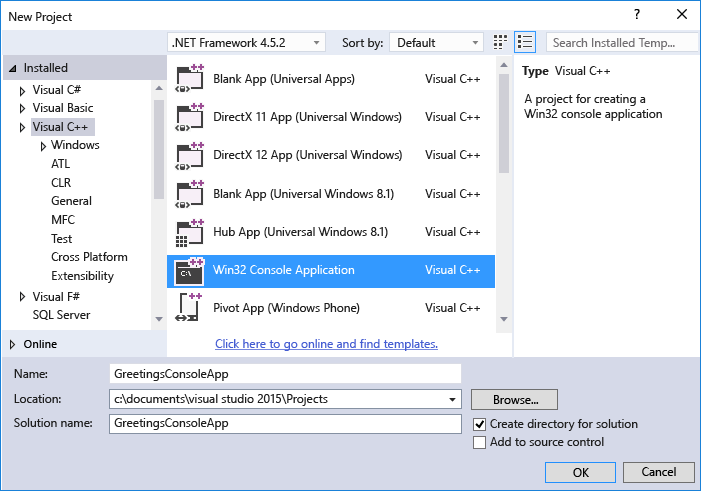
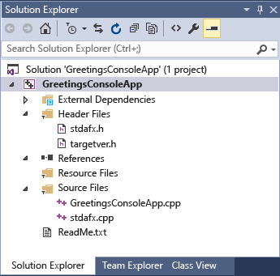
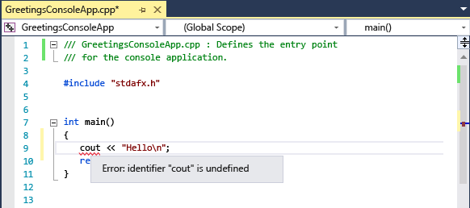
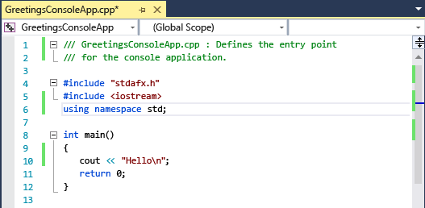
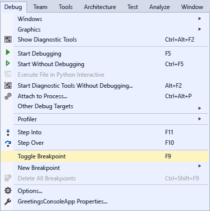
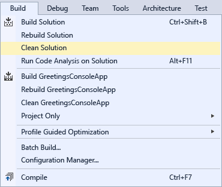

# Getting Started with C++ in Visual Studio
By completing this walkthrough, you’ll become familiar with many of the tools and dialog boxes that you can use when you develop applications with Visual Studio. You’ll create a simple "Hello, World"-style application while you learn more about working in the integrated development environment (IDE).  
  
 This topic contains the following sections:  
  
 [Sign In to Visual Studio](../ide/getting-started-with-c---in-visual-studio.md#BKMK_Configure)  
  
 [Create a simple application](../ide/getting-started-with-c---in-visual-studio.md#BKMK_CreateApp)  
  
 [Add Code to the Application](../ide/getting-started-with-c---in-visual-studio.md#BKMK_AddCode)  
  
 [Debug and Test the application](../ide/getting-started-with-c---in-visual-studio.md#BKMK_DebugTest)  
  
 [Build a release version of the app](../ide/getting-started-with-c---in-visual-studio.md#BKMK_BuildRelease)  
  
##  <a name="BKMK_Configure"></a> Sign In to Visual Studio  
 When you start Visual Studio for the first time, you are given the chance to sign in using a Microsoft account such as Live or Outlook. Signing in allows your settings to be synchronized across all your devices. For more information, see [Signing in to Visual Studio](../ide/signing-in-to-visual-studio.md)  
  
 Figure 1: Visual Studio IDE  
  
   
  
 After you open Visual Studio, you can see the three basic parts of the IDE: tool windows, menus and toolbars, and the main window space. Tool windows are docked on the left and right sides of the app window, with **Quick Launch**, the menu bar, and the standard toolbar at the top. The center of the application window contains the **Start Page**. When you open a solution or project, editors and designers appear in this space. When you develop an application, you’ll spend most of your time in this central area.  
  
##  <a name="BKMK_CreateApp"></a> Create a simple application  
 When you create an app in Visual Studio, you first create a project and a solution. For this example, you’ll create a Windows console application.  
  
#### To create a console app  
  
1.  On the menu bar, choose **File**, **New**, **Project**.  
  
       
  
2.  In the **Visual C++** category, choose the **Win32 Console Application** template, and then name the project `GreetingsConsoleApp`.  
  
       
  
3.  When the Win32 Application Wizard appears, choose the **Finish** button.  
  
       
  
 The GreetingsConsoleApp project and solution, with the basic files for a Win32 console app, are created and automatically loaded into **Solution Explorer**. The GreetingsConsoleApp.cpp file is opened in the code editor. The following items appear in **Solution Explorer**:  
  
 Figure 4: Project items  
  
   
  
##  <a name="BKMK_AddCode"></a> Add Code to the Application  
 Next, you'll add code to display the word "Hello" in the console window.  
  
#### To display “Hello” in the console window  
  
1.  In the GreetingsConsoleApp.cpp file, enter a blank line before the line `return 0;` and then enter the following code:  
  
    ```  
    cout << "Hello\n";  
    ```  
  
     A red squiggly line appears under `cout`. An error message appears if you point to it.  
  
       
  
     The error message also appears in the **Error List** window. You can display the window by, on the menu bar, choosing **View**, **Error List**.  
  
     [cout](../Topic/cout.md) is included in the <iostream> header file.  
  
2.  To include the iostream header, enter the following code after `#include "stdafx.h"`:  
  
    ```  
    #include <iostream>  
    using namespace std;  
    ```  
  
     You probably noticed that a box appeared as you entered code, providing suggestions for the characters that you entered. This box is part of C++ IntelliSense, which provides coding prompts, including listing class or interface members and parameter information. You can also use code snippets, which are pre-defined blocks of code. For more information, see [Using IntelliSense](../ide/using-intellisense.md) and [Code Snippets](../ide/code-snippets.md).  
  
     The red squiggly line under `cout` disappears when you fix the error.  
  
3.  Save the changes to the file.  
  
       
  
##  <a name="BKMK_DebugTest"></a> Debug and Test the application  
 You can debug GreetingsConsoleApp to see whether the word "Hello" appears in the console window.  
  
#### To debug the application  
  
-   Start the debugger.  
  
       
  
     The debugger starts and runs the code. The console window (a separate window that looks like a command prompt) appears for a few seconds but closes quickly when the debugger stops running. To see the text, you need to set a breakpoint to stop program execution.  
  
#### To add a breakpoint  
  
1.  Add a breakpoint from the menu bar at the line `return 0;`. You can also just click in the left margin to set a breakpoint.  
  
       
  
     A red circle appears next to the line of code in the far left margin of the editor window.  
  
2.  Choose the F5 key to start debugging.  
  
     The debugger starts, and a console window appears showing the word **Hello**.  
  
       
  
3.  Press SHIFT + F5 to stop debugging.  
  
 For more information, see [Console Projects](../debugger/debugging-preparation--console-projects.md).  
  
##  <a name="BKMK_BuildRelease"></a> Build a release version of the app  
 Now that you’ve verified that everything works, you can prepare a release build of the application.  
  
#### To clean the solution files and build a release version  
  
1.  From the menu bar, delete intermediate files and output files that were created during previous builds.  
  
       
  
2.  Change the build configuration for GreetingsConsoleApp from **Debug** to **Release**.  
  
       
  
3.  Build the solution.  
  
       
  
 Congratulations on completing this walkthrough! If you want to explore more examples, see [Visual Studio Samples](../ide/visual-studio-samples.md).  
  
## See Also  
 [Walkthrough: Create a Simple Application](../ide/walkthrough--create-a-simple-application-with-visual-csharp-or-visual-basic.md)   
 [Productivity Tips](../ide/productivity-tips-for-visual-studio.md)   
 [Visual Studio Samples](../ide/visual-studio-samples.md)   
 [Get Started Developing with Visual Studio](../ide/get-started-developing-with-visual-studio.md)