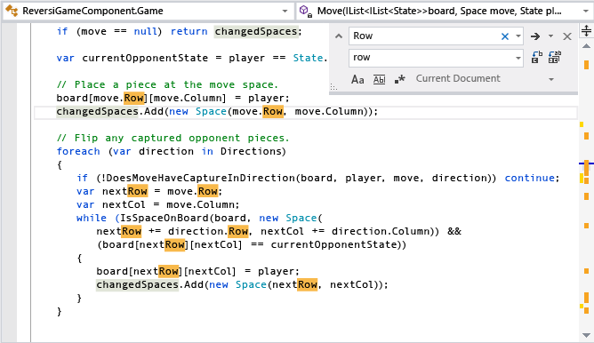
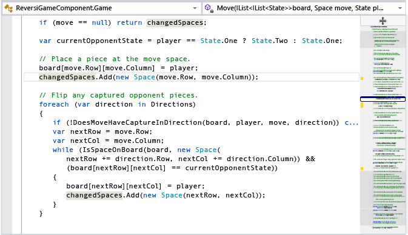

# How to: Track Your Code by Customizing the Scrollbar
When you are working with long code files, it can be hard to keep everything in mind. You can customize the scroll bar of the code window to give you a bird's eye view of what's happening in your code.  
  
### To show annotations on the scroll bar  
  
1.  You can set up the scroll bar to show code changes, breakpoints, errors, and bookmarks.  
  
     Open the **Scroll Bar** options page (**Tools, Options Text Editor. All Languages** or a specific language, or type  **scroll bar** in the Quick Launch window).  
  
2.  Select **Show Annotations over vertical scroll bar**, then select the annotations you want to see. (The **Marks** option includes breakpoints and bookmarks.)  
  
3.  Now try it out. Open a large code file and replace something that occurs in several places in the file. The scroll bar shows you the effect of the replacements, so you can back out your changes if you replaced something you shouldn't have.  
  
     Here's how the scroll bar looks after a search for a string. Notice that all instances of the string appear.  
  
       
  
     Here's the scroll bar after replacing all the instances of the string. You can see immediately that the operation caused some problems.  
  
       
  
### To set the display mode for the scroll bar  
  
1.  The scroll bar has two modes, bar mode (the default) and map mode. Bar mode just displays annotation indicators on the scroll bar. In map mode the lines of code are represented on the scroll bar. You can choose how wide they are and whether they show the underlying code when you rest the pointer on them. When you click a location on the scroll bar, the cursor moves to that location in the code. Collapsed regions are shaded differently; they are expanded when you double-click them.  
  
     On the **Scroll Bar** options page, select either **Use Bar mode for vertical scroll bar** or **Use Map mode for vertical scroll bar**. You can choose the width in the **Source Overview** dropdown.  
  
     Here's how the search example looks when map mode is on and the width is set to Medium:  
  
       
  
2.  In map mode, to enable previews of the code when you move the cursor up and down the scroll bar, select the **Show Preview Tooltip** option. Here's how it looks:  
  
       
  
     If you want to keep the map mode scrolling behavior and the preview tooltip but don't want to see the source code overview, you can set **Source Overview** to **Off**.