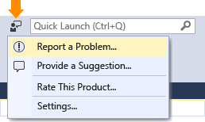
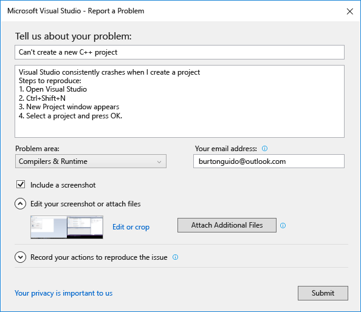
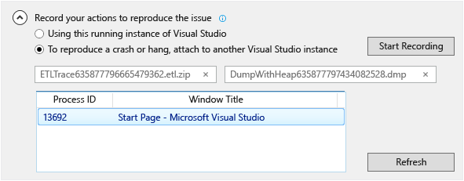

# How to Report a Problem with Visual Studio 2015
If you encounter a problem with Visual Studio, we want to know about it so that we can diagnose and fix it.  By using the **Report a Problem** tool, you can collect detailed  information about the problem, and send it to Microsoft with just a few button clicks.  
  
 Microsoft respects your privacy. For information about how we treat the data that you send to us, see [Microsoft Visual Studio Product Family Privacy Statement](https://www.visualstudio.com/en-us/dn948229).  
  
## Open the Report a Problem tool  
 Click on the user feedback icon next to **Quick Launch** in the title bar, or click on           **Help &#124; Send Feedback &#124; Report a Problem**.  
  
   
  
## Describe the problem  
  
###    
  
1.  Give a descriptive title for the problem that will help us route it to the correct team within Visual Studio.  
  
2.  Give any additional details and if possible, the steps to reproduce the problem.  
  
3.  Choose a problem area from the dropdown. Make a best guess if you are not sure.  
  
   
  
## Provide a screenshot (optional)  
 Choose **Include a screenshot** to send your current screen to Microsoft. The tool enables you to crop the image to show only            the part of the screen that shows the problem. You can attach additional screenshots or other files by clicking the **Attach Additional Files** button.  
  
## Provide a trace and heap dump (optional)  
  
###    
  
1.  Trace and heap dump files are very useful in helping us diagnose problems.   We appreciate it very much when you use the Report a Problem tool to record your repro steps and send the data to Microsoft.  
  
2.  Click the chevron next to **Record your actions to reproduce the issue**. If your problem is causing Visual Studio to hang or crash, then open up another instance of Visual Studio and select it from the list view.  
  
3.  Click on **Start Recording** and perform the steps that reproduce the problem. When you are done, click on the **Stop Record** button in the floating window.  
  
4.  Wait a few minutes for Visual Studio to collect and package up the information that was recorded. The dialog will look something like this when the collection process is complete:  
  
       
  
## Describe the workaround, if there is one  
 If you were able to work around the problem, please describe the workaround in the edit box provided for that purpose. This helps us not only to diagnose the problem, but also to help other users who may encounter the same problem.  
  
## Submit the report  
 Click on the submit button to send your report, along with any images and trace or dump files. If the **Submit** button is grayed out, make sure that you have provided a title and description.  
  
## See Also  
 [Talk to Us](../ide/talk-to-us.md)