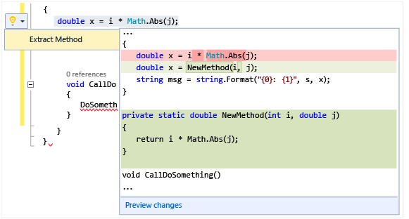

# Perform quick actions with light bulbs
Light bulbs are a new productivity feature in Visual Studio 2015. They are icons that appear in the Visual Studio editor and that you can click to perform quick actions including refactoring fixing errors. Light bulbs bring error-fixing and refactoring assistance into a single focal point, often right on the line where you are typing.  
  
   
  
 In C# and Visual Basic, you will see a light bulb if there is a red squiggle and Visual Studio has a suggestion for how to fix the issue. For instance if you have an error indicated by a red squiggle, a light bulb will appear when fixes are available for that error. In C++, when you add a new function to a header file, you’ll see a light bulb that offers to create a stub implementation of that function. For any language, third parties can provide custom diagnostics and suggestions, for example as part of an SDK, and Visual Studio light bulbs will light up based on those rules.  
  
## To see a light bulb  
  
1.  In many cases, light bulbs spontaneously appear when you hover the mouse at the point of an error, or in the left margin of the editor when you move the caret into a line that has an error in it. When you see a red squiggle, you can hover over it to display the light bulb. You can also cause a light bulb to display when you use the mouse or keyboard to go to anywhere in the line where the issue occurs.  
  
2.  Press **Ctrl + .** anywhere on a line to invoke the light bulb and go directly to the list of potential fixes.  
  
   
  
## To see potential fixes  
 Either click on the down arrow or the Show potential fixes link to display a list of quick actions that the light bulb can take for you.  
  
   
  
## To do a refactoring  
 You can still perform refactorings by right clicking to bring up the context menu, but you can also press Ctrl + . to display refactoring options. In the following illustration, the Extract Method refactoring is offered after pressing Ctrl + . somewhere on the line that contains the `Math.Abs` call:  
  
 