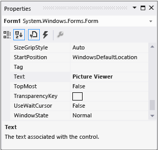
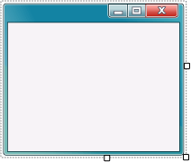

# Step 3: Set Your Form Properties
Next, you use the **Properties** window to change the way your form looks.  
  
 For a video version of this topic, see [Tutorial 1: Create a Picture Viewer in Visual Basic - Video 1](http://go.microsoft.com/fwlink/?LinkId=205209) or [Tutorial 1: Create a Picture Viewer in C# - Video 1](http://go.microsoft.com/fwlink/?LinkId=205199). These videos use an earlier version of Visual Studio, so there are slight differences in some menu commands and other user interface elements. However, the concepts and procedures work similarly in the current version of Visual Studio.  
  
### To set your form properties  
  
1.  Be sure you're looking at Windows Forms Designer. In the Visual Studio integrated development environment (IDE), choose the **Form1.cs [Design]** tab (or the **Form1.vb [Design]** tab in Visual Basic).  
  
2.  Choose anywhere inside the form **Form1** to select it. Look at the **Properties** window, which should now be showing the properties for the form. Forms have various properties. For example, you can set the foreground and background color, title text that appears at the top of the form, size of the form, and other properties.  
  
    > [!NOTE]
    >  If the **Properties** window doesn't appear, stop your program by choosing the square **Stop Debugging** button on the toolbar, or just close the window. If the program is stopped and you still don't see the **Properties** window, on the menu bar, choose **View**, **Properties Window**.  
  
3.  After the form is selected, find the **Text** property in the **Properties** window. Depending on how the list is sorted, you might need to scroll down. Choose **Text**, type **Picture Viewer**, and then choose ENTER.  Your form should now have the text **Picture Viewer** in its title bar, and the **Properties** window should look similar to the following picture.  
  
       
Properties window  
  
    > [!NOTE]
    >  Properties can be ordered by a Categorized or Alphabetical view. You can switch between these two views by using the buttons on the **Properties** window. In this tutorial, it's easier to find properties through the Alphabetical view.  
  
4.  Go back to Windows Forms Designer. Choose the form's lower-right drag handle, which is the small white square in the lower-right of the form and appears as follows.  
  
       
Drag handle  
  
     Drag the handle to resize the form so the form is wider and a bit taller.  
  
5.  Look at the **Properties** window, and notice that the **Size** property has changed. The **Size** property changes each time you resize the form. Try dragging the form's handle to resize it to a form size of approximately 550, 350 (no need to be exact), which should work well for this project. As an alternative, you can enter the values directly in the **Size** property and then choose the ENTER key.  
  
6.  Run your program again. Remember, you can use any of the following methods to run your program.  
  
    -   Choose the **F5** key.  
  
    -   On the menu bar, choose **Debug**, **Start Debugging**.  
  
    -   On the toolbar, choose the **Start Debugging** button, which appears as follows.  
  
           
Start Debugging toolbar button  
  
     Just like before, the IDE builds and runs your program, and a window appears.  
  
7.  Before going to the next step, stop your program, because the IDE won't let you change your program while it's running. Remember, you can use any of the following methods to stop your program.  
  
    -   On the toolbar, choose the **Stop Debugging** button.  
  
    -   On the menu bar, choose **Debug**, **Stop Debugging**.  
  
    -   Choose the X button in the upper corner of the **Form1** window.  
  
### To continue or review  
  
-   To go to the next tutorial step, see [Step 4: Lay Out Your Form with a TableLayoutPanel Control](../ide/step-4--lay-out-your-form-with-a-tablelayoutpanel-control.md).  
  
-   To return to the previous tutorial step, see [Step 2: Run Your Program](../ide/step-2--run-your-program.md).