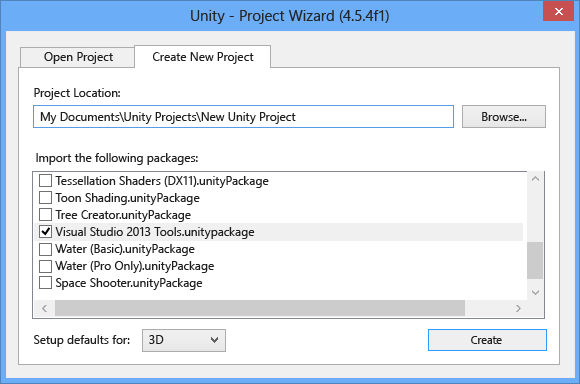

# Setting Up Visual Studio Tools for Unity with Older Versions of Unity (Pre-5.2)
In this section, you'll learn how to set up Visual Studio Tools for Unity with an older version of Unity (pre-5.2), and start using Visual Studio with your Unity project.  
  
> [!IMPORTANT]
>  This document applies only to versions of Unity older than Unity 5.2 on Windows, which added built-in support for Visual Studio Tools for Unity when using Visual Studio as your code editor. Whenever this document refers to Unity, it refers only to versions prior to Unity 5.2 on Windows. For information on how to set up Visual Studio Tools for Unity with Unity 5.2 or higher, see [Getting Started](../Topic/Getting%20Started%20with%20Visual%20Studio%20Tools%20for%20Unity.md).  
  
## Prerequisites  
 Before you can install and use Visual Studio Tools for Unity, you'll need to install these prerequisites:  
  
-   A version of **Visual Studio** that supports extensions, such as Visual Studio Community, Professional, Premium, or Enterprise. You can download Visual Studio Community for free.  
  
     [Download Visual Studio Community](http://www.visualstudio.com/downloads/download-visual-studio-vs)  
  
-   **Unity** version 4.0.0 or higher  
  
     [Download Unity](https://unity3d.com/get-unity/download)  
  
## Install Visual Studio Tools for Unity  
 Download and install Visual Studio Tools for Unity from the Visual Studio Gallery. You'll need to install the right package for your version of Visual Studio.  
  
-   For Visual Studio 2015 Community, Visual Studio 2015 Professional, or Visual Studio 2015 Enterprise:  
  
     [Download Visual Studio 2015 Tools for Unity](https://visualstudiogallery.msdn.microsoft.com/8d26236e-4a64-4d64-8486-7df95156aba9)  
  
-   For Visual Studio 2013 Community, Visual Studio 2013 Professional, or Visual Studio 2013 Premium:  
  
     [Download Visual Studio 2013 Tools for Unity](https://visualstudiogallery.msdn.microsoft.com/20b80b8c-659b-45ef-96c1-437828fe7cf2)  
  
-   For Visual Studio 2012 Professional or Visual Studio 2012 Premium:  
  
     [Download Visual Studio 2012 Tools for Unity](https://visualstudiogallery.msdn.microsoft.com/7ab11d2a-f413-4ed6-b3de-ff1d05157714)  
  
-   For Visual Studio 2010 Professional or Visual Studio 2010 Premium:  
  
     [Download Visual Studio 2010 Tools for Unity](https://visualstudiogallery.msdn.microsoft.com/6e536faa-ce73-494a-a746-6a14753015f1)  
  
> [!NOTE]
>  Express versions of Visual Studio don't support extensions such as Visual Studio Tools for Unity. Visual Studio Community is a free version of Visual Studio that supports Visual Studio Tools for Unity and other extensions. For most users, Visual Studio Community is a better choice than Express.  
  
## Your first Unity project with Visual Studio Tools for Unity  
 Now that you have everything you need, you're ready for your first Unity project with Visual Studio. Just follow these steps.  
  
### 1 - Create a Unity Project  
 If you're new to Unity, start small with a basic tutorial. Visit the Unity Learn page to find tutorials on example projects you can start with and lessons you can learn from to build your own game with Unity. The Unity Learn page has easy-to-follow tutorials for several different games.  
  
 [Tutorials – Unity Learn page](http://unity3d.com/learn/tutorials/modules)  
  
 If you create a new Unity project instead of starting from an existing project, import the Visual Studio Tools for Unity package when you create it.  
  
   
  
### 2 - Configure Unity Editor to use Visual Studio Tools for Unity  
 If you're starting from an existing project or you didn't import the Visual Studio Tools Unity package when you created your Unity project, you need to import it now. In the Unity editor, on the main menu, choose **Assets, Import Package, Visual Studio 2013 Tools** (you should see an option for the version of Visual Studio you have installed).  
  
   
  
 After you've imported the package, make sure you've set a build target through the **Build Settings** page and that **Script Debugging** is enabled.  
  
   
  
### 3 - Launch Visual Studio from Unity Editor  
 The final step is to start Visual Studio from Unity. This creates a Visual Studio Solution for your project, and then opens it in Visual Studio. In the Unity Editor, on the main menu, choose **Visual Studio Tools, Open in Visual Studio**.  
  
   
  
 Now you can edit and debug your Unity game from Visual Studio.  
  
## Next steps  
 To learn how to work with and debug your Unity project in Visual Studio, see [Using Visual Studio Tools for Unity](../Topic/Using%20Visual%20Studio%20Tools%20for%20Unity.md).  
  
## See Also  
 [Unity Homepage](http://unity3d.com)