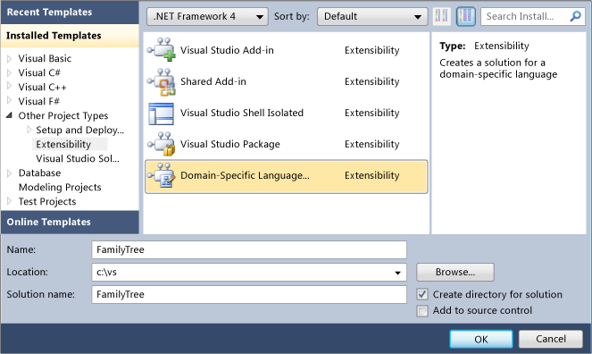

# How to: Create a Domain-Specific Language Solution
A domain-specific language (DSL) is created by using a specialized [!INCLUDE[vsprvs](../code-quality/includes/vsprvs_md.md)] solution.  
  
## Prerequisites  
 Before you can start this procedure, you must first install these components:  
  
|||  
|-|-|  
|[!INCLUDE[vsprvs](../code-quality/includes/vsprvs_md.md)]|[http://go.microsoft.com/fwlink/?LinkID=185579](http://go.microsoft.com/fwlink/?LinkID=185579)|  
|[!INCLUDE[vssdk_current_short](../modeling/includes/vssdk_current_short_md.md)]|[http://go.microsoft.com/fwlink/?LinkID=185580](http://go.microsoft.com/fwlink/?LinkID=185580)|  
|Visual Studio Visualization and Modeling SDK|[http://go.microsoft.com/fwlink/?LinkID=185581](http://go.microsoft.com/fwlink/?LinkID=185581)|  
  
## Creating a Domain-Specific Language Solution  
  
#### To create a domain-specific language solution  
  
1.  Start the DSL Wizard.  
  
    1.  On the **File** menu, point to **New**, and then click **Project**.  
  
    2.  The **New Project** dialog box appears.  
  
    3.  Under **Project types**, expand the **Other Project Types** node, and click **Extensibility**.  
  
    4.  Click **Domain-Specific Language Designer**.  
  
    5.  In the **Name** box, type a name for the solution. Click **OK**.  
  
         The **Domain-Specific Language Designer Wizard** appears.  
  
        > [!NOTE]
        >  Preferably, the name that you type should be a valid Visual C# identifier, because it might be used to generate code.  
  
       
  
2.  Choose a DSL template.  
  
     On the **Select Domain-Specific Language Options** page, select one of the solution templates such as **Minimal Language**. Choose a template that is similar to the DSL that you want to create.  
  
     For more information about solution templates, see [Choosing a Domain-Specific Language Solution Template](../modeling/choosing-a-domain-specific-language-solution-template.md).  
  
3.  Enter a filename extension on the **File Extension** page. It should be unique in your computer, and in any computers on which you want to install the DSL. You should see the message **No applications or Visual Studio editors use this extension**.  
  
    -   If you have used the file name extension in previous experimental DSLs that have not been fully installed, you can clear them out by using the **Reset the Experimental Instance** tool, which can be found in the [!INCLUDE[vsprvs](../code-quality/includes/vsprvs_md.md)] SDK menu.  
  
    -   If another [!INCLUDE[vsprvs](../code-quality/includes/vsprvs_md.md)] Extension that uses this file extension has been fully installed on your computer, consider uninstalling it. On the **Tools** menu, click **Extension Manager**.  
  
4.  Inspect, and if necessary adjust, the fields in the remaining pages of the wizard. When you are satisfied with the settings, click **Finish**. For more information about the settings, see [DSL Designer Wizard Pages](#settings).  
  
     The wizard creates a solution that has two projects, which are named **Dsl** and **DslPackage**.  
  
    > [!NOTE]
    >  If you see a message that alerts you not to run text templates from untrusted sources, click **OK**. You can set this message not to appear again.  
  
##   The DSL Designer Wizard Pages  
 You can leave several of the fields unchanged from their default values. However, make sure that you set the File Extension field.  
  
### Solution Settings page  
 **Which Template would you like to base your domain specific language on?**  
 Choose a template that is similar to the DSL that you want to create. The different templates provide convenient starting points. When you select a solution template, the wizard displays a description. For more information about solution templates, see [Choosing a Domain-Specific Language Solution Template](../modeling/choosing-a-domain-specific-language-solution-template.md).  
  
 **What do you want to name your domain-specific language?**  
 Defaults to the solution name. Code is generated from this value. It must be valid as a C# class name.  
  
### File Extension page  
 **What extension should model files use?**  
 Type a new file extension.  
  
 Verify that this file extension has not already been registered for use in this computer, as follows:  
  
 Look under **Other tools and applications registered to handle this extension**. If you see the message **No applications or Visual Studio editors use this extension**, then you can use this file extension.  
  
 If you see a list of tools or packages, you should do one of the following:  
  
-   Type a different file extension.  
  
     \- or -  
  
-   Reset the [!INCLUDE[vsprvs](../code-quality/includes/vsprvs_md.md)] Experimental Instance. This will unregister all of the DSLs that you have previously built. On the **Start** menu, click **All Programs**, **Microsoft Visual Studio 2010 SDK**, **Tools**, and then **Reset the Microsoft Visual Studio 2010 Experimental instance**. You can rebuild any other DSLs that you want to use again.  
  
     \- or -  
  
-   If a [!INCLUDE[vsprvs](../code-quality/includes/vsprvs_md.md)] Extension that uses this file extension has been fully installed on your computer, uninstall it. On the **Tools** menu, click **Extension Manager**.  
  
### Product Settings page  
 **What is the name of the product that the new domain-specific language belongs to?**  
 Defaults to the DSL name.  
  
 This value is used in Windows Explorer (or File Explorer) to describe files that have this file extension.  
  
 **What is the name of the company that the product belongs to?**  
 Your company name.  
  
 This value is incorporated into the AssemblyInfo properties of your DSL package.  
  
 **What is the root namespace for projects in this solution?**  
 This defaults to a name composed from your company and product names.  
  
### Signing page  
 **Create a strong name key file**  
 The default option is to create a new key to sign your DSL assembly.  
  
 **Use existing strong name key**  
 Use this option if you want to integrate your DSL with another assembly.  
  
 For more information about strong naming, see [Creating and Using Strong-Named Assemblies](http://go.microsoft.com/fwlink/?LinkId=186073).  
  
## See Also  
 [How to Define a Domain-Specific Language](../modeling/how-to-define-a-domain-specific-language.md)   
 [Domain-Specific Language Tools Glossary](http://msdn.microsoft.com/en-us/ca5e84cb-a315-465c-be24-76aa3df276aa)