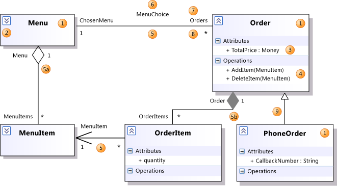
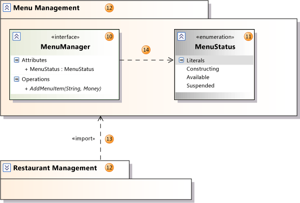

# UML Class Diagrams: Reference
A UML class diagram describes the object and information structures used by your application, both internally and in communication with its users. It describes the information without reference to any particular implementation. Its classes and relationships can be implemented in many ways, such as database tables, XML nodes, or compositions of software objects.  
  
> [!NOTE]
>  This topic is about UML class diagrams. There is another kind of class diagram, the .NET class diagram, which is used to visualize program code. For more information, see [Designing and Viewing Classes and Types](http://go.microsoft.com/fwlink/?LinkId=142231).  
  
 To create a UML class diagram, on the **Architecture** menu, choose **New UML or Layer Diagram**. For more information about how to draw UML class diagrams, see [UML Class Diagrams: Guidelines](../modeling/uml-class-diagrams--guidelines.md). For more information about how to create and draw modeling diagrams, see [Edit UML models and diagrams](../modeling/edit-uml-models-and-diagrams.md).  
  
 To see which versions of Visual Studio support this feature, see [Version support for architecture and modeling tools](../modeling/what-s-new-for-design-in-visual-studio.md#VersionSupport).  
  
## Reading Class Diagrams  
 The table in this section describes the elements that you can see on a UML class diagram. For information about the properties of these elements, see the following topics:  
  
-   [Properties of types on UML class diagrams](../modeling/properties-of-types-on-uml-class-diagrams.md)  
  
-   [Properties of attributes on UML class diagrams](../modeling/properties-of-attributes-on-uml-class-diagrams.md)  
  
-   [Properties of operations on UML class diagrams](../modeling/properties-of-operations-on-uml-class-diagrams.md)  
  
-   [Properties of associations on UML class diagrams](../modeling/properties-of-associations-on-uml-class-diagrams.md)  
  
   
  
|**Shape**|**Element**|**Description**|  
|---------------|-----------------|---------------------|  
|1|**Class**|A definition of objects that share given structural or behavioral characteristics. For more information, see [Properties of types on UML class diagrams](../modeling/properties-of-types-on-uml-class-diagrams.md).|  
|1|Classifier|The general name for a class, interface, or enumeration. Components, use cases, and actors are also classifiers.|  
|2|Collapse/ Expand control|If you cannot see the details of a classifier, click the expander at upper-left of the classifier. You might also have to click the [+] on each segment.|  
|3|**Attribute**|A typed value attached to each instance of a classifier.   To add an attribute, click the **Attributes** section and then press **ENTER**. Type the signature of the attribute. For more information, see [Properties of attributes on UML class diagrams](../modeling/properties-of-attributes-on-uml-class-diagrams.md).|  
|4|**Operation**|A method or function that can be performed by instances of a classifier. To add an operation, click the **Operations** section and then press **ENTER**. Type the signature of the operation. For more information, see [Properties of operations on UML class diagrams](../modeling/properties-of-operations-on-uml-class-diagrams.md).|  
|5|**Association**|A relationship between the members of two classifiers. For more information, see [Properties of associations on UML class diagrams](../modeling/properties-of-associations-on-uml-class-diagrams.md).|  
|5a|**Aggregation**|An association representing a shared ownership relationship. The **Aggregation** property of the owner role is set to **Shared**.|  
|5b|**Composition**|An Association representing a whole-part relationship. The **Aggregation** property of the owner role is set to **Composite**.|  
|6|**Association Name**|The name of an association. The name can be left empty.|  
|7|**Role Name**|The name of a role, that is, one end of an association. Can be used to refer to the associated object. In the previous illustration, for any Order `O`, `O.ChosenMenu` is its associated Menu.   Each role has its own properties, listed under the properties of the association.|  
|8|**Multiplicity**|Indicates how many of the objects at this end can be linked to each object at the other. In the example, each Order must be linked to exactly one Menu.   **\*** means that there is no upper limit to the number of links that can be made.|  
|9|**Generalization**|The *specific* classifier inherits part of its definition from the *general* classifier. The general classifier is at the arrow end of the connector. Attributes, associations, and operations are inherited by the specific classifier.   Use the **Inheritance** tool to create a generalization between two classifiers.|  
  
   
  
|Shape|Element|Description|  
|-----------|-------------|-----------------|  
|10|**Interface**|A definition of part of the externally visible behavior of an object. For more information, see [Properties of types on UML class diagrams](../modeling/properties-of-types-on-uml-class-diagrams.md).|  
|11|**Enumeration**|A classifier that consists of a set of literal values.|  
|12|**Package**|A group of classifiers, associations, actions, lifelines, components and packages. A logical class diagram shows that the member classifiers and packages are contained within the package.   Names are scoped within packages so that **Class1** within **Package1** is distinct from **Class1** outside that package. The name of the package appears as part of the **Qualified Name** properties of its contents.   You can set the **Linked Package** property of any UML diagram to refer to a package. All the elements that you create on that diagram will then become part of the package. They will appear under the package in **UML Model Explorer**.|  
|13|**Import**|A relationship between packages, indicating that one package includes all the definitions of another.|  
|14|**Dependency**|The definition or implementation of the dependent classifier might change if the classifier at the arrowhead end is changed.|  
  
   
  
|Shape|**Element**|Description|  
|-----------|-----------------|-----------------|  
|15|**Realization**|The class implements the operations and attributes defined by the interface.   Use the **Inheritance** tool to create a realization between a class and an interface.|  
|16|**Realization**|An alternative presentation of the same relationship. The label on the lollipop symbol identifies the interface.   To create this presentation, select an existing realization relationship. An action tag appears near the association. Click the action tag, and then click **Show as Lollipop**.|  
  
## See Also  
 [Edit UML models and diagrams](../modeling/edit-uml-models-and-diagrams.md)   
 [UML Class Diagrams: Guidelines](../modeling/uml-class-diagrams--guidelines.md)   
 [Properties of types on UML class diagrams](../modeling/properties-of-types-on-uml-class-diagrams.md)   
 [Properties of attributes on UML class diagrams](../modeling/properties-of-attributes-on-uml-class-diagrams.md)   
 [Properties of operations on UML class diagrams](../modeling/properties-of-operations-on-uml-class-diagrams.md)   
 [Properties of associations on UML class diagrams](../modeling/properties-of-associations-on-uml-class-diagrams.md)