# Use code maps to debug your applications
Code maps can help you avoid getting lost in large code bases, unfamiliar code, or legacy code. For example, when you’re debugging, you might have to look at code across many files and projects. Use code maps to navigate around pieces of code and understand the relationships between them. That way, you don't have to keep track of this code in your head, or draw a separate diagram. So, when your work is interrupted, code maps help refresh your memory about the code you're working on.  
  
 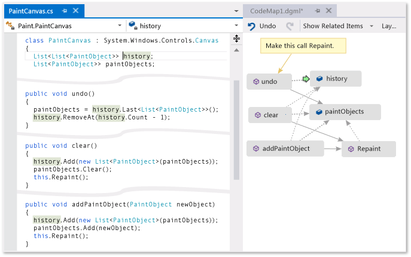  
  
 **A green arrow shows where your cursor appears in the editor**  
  
 For details of the commands and actions you can use when working with code maps, see [Browse and rearrange code maps](../modeling/browse-and-rearrange-code-maps.md).  
  
## Understand the problem  
 Suppose there's a bug in a drawing program that you're working on. To reproduce the bug, you open the solution in Visual Studio and press **F5** to start debugging.  
  
 When you draw a line and choose **Undo my last stroke**, nothing happens until you draw the next line.  
  
 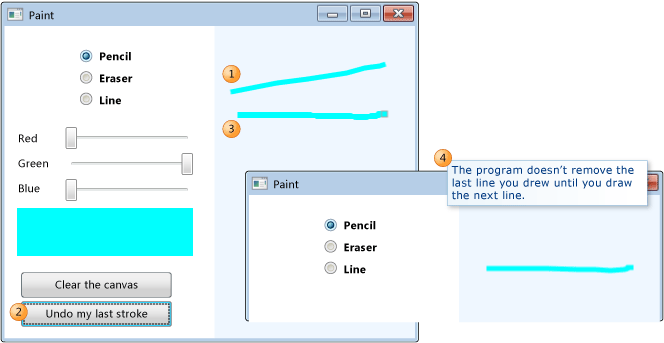  
  
 So you start investigating by searching for the `Undo` method. You find it in the `PaintCanvas` class.  
  
 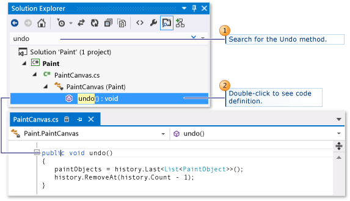  
  
## Start mapping the code  
 Now start mapping the `undo` method and its relationships. From the code editor, you add the `undo` method and the fields that it references to a new code map. When you create a new map, it might take some time to index the code. This helps later operations run faster.  
  
 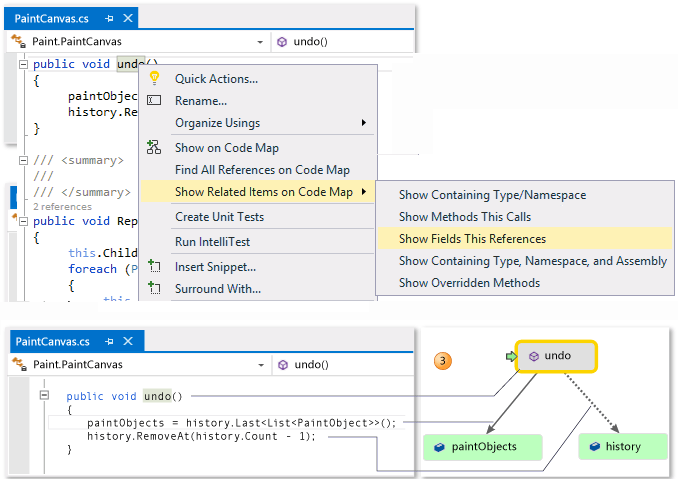  
  
> [!TIP]
>  The green highlighting shows the last items that were added to the map. The green arrow shows your cursor’s position in the code. Arrows between items represent different relationships. You can get more info about items on the map by moving the mouse over them and examining their tooltips.  
  
 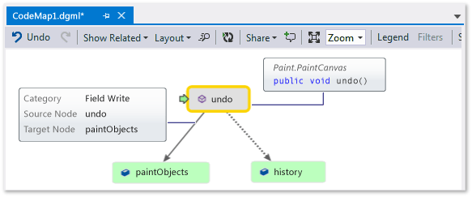  
  
## Navigate and examine code from the map  
 To see the code definition for each field, double-click the field on the map or select the field and press **F12**. The green arrow moves between items on the map. Your cursor in the code editor also moves automatically.  
  
 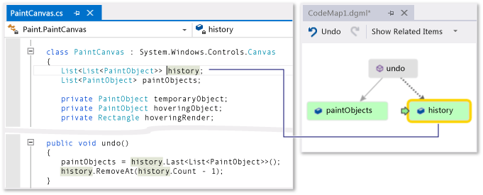  
  
 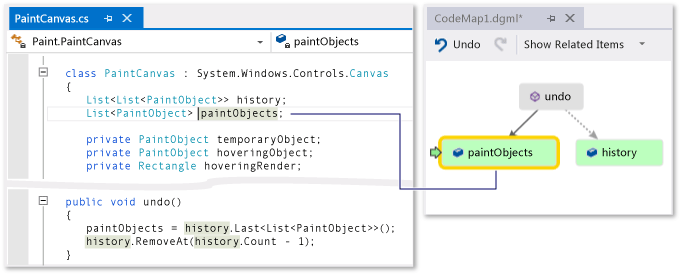  
  
> [!TIP]
>  You can also move the green arrow on the map by moving your cursor in the code editor.  
  
## Understand relationships between pieces of code  
 Now you want to know which other code interacts with the `history` and `paintObjects` fields. You can add all the methods that reference these fields to the map. You can do this from the map or from the code editor.  
  
 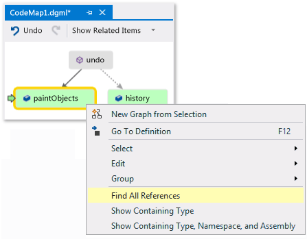  
  
 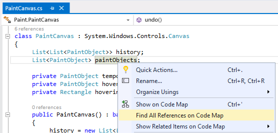  
  
> [!NOTE]
>  If you add items from a project that's shared across multiple apps, like Windows Phone or Windows Store, then those items always appear with the currently active app project on the map. So, if you change the context to another app project, then the context on the map also changes for any newly added items from the shared project. Operations that you perform with an item on the map apply only to those items that share the same context.  
  
 Change the layout to rearrange the flow of relationships and make the map easier to read. You can also move items around the map by dragging them.  
  
 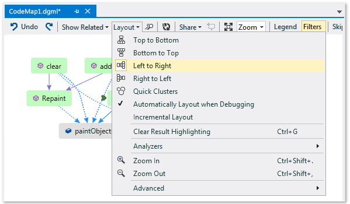  
  
> [!TIP]
>  By default, **Incremental Layout** is turned on. This rearranges the map as little as possible when you add new items. To rearrange the entire map every time you add new items, turn off **Incremental Layout**.  
  
 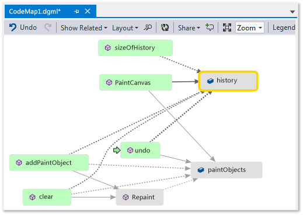  
  
 Let's examine these methods. On the map, double-click the **PaintCanvas** method, or select this method and press **F12**. You learn that this method creates `history` and `paintObjects` as empty lists.  
  
 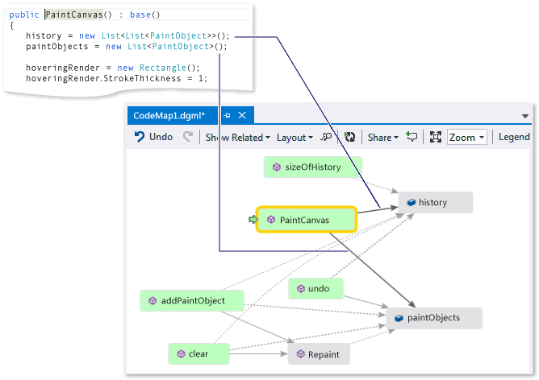  
  
 Now repeat the same steps to examine the `clear` method definition. You learn that `clear` performs some tasks with `paintObjects` and `history`. It then calls the `Repaint` method.  
  
 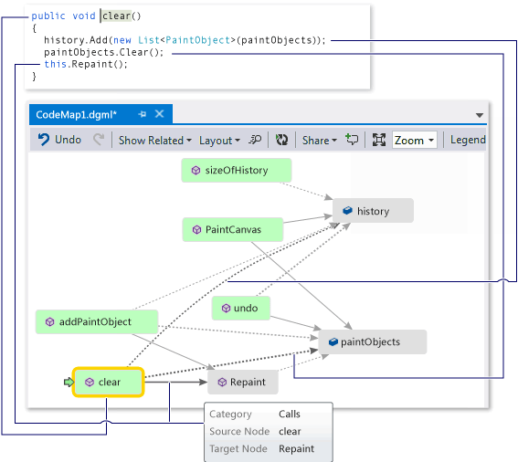  
  
 Now examine the `addPaintObject` method definition. It also performs some tasks with `history` and `paintObjects`. It also calls `Repaint`.  
  
 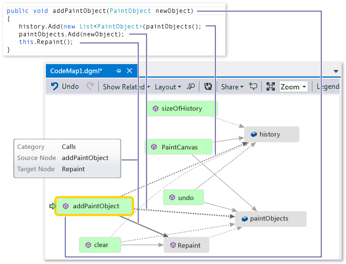  
  
## Find the problem by examining the map  
 It seems that all the methods that modify `history` and `paintObjects` call `Repaint`. Yet the `undo` method doesn't call `Repaint`, even though `undo` modifies the same fields. So you think you can fix this problem by calling `Repaint` from `undo`.  
  
 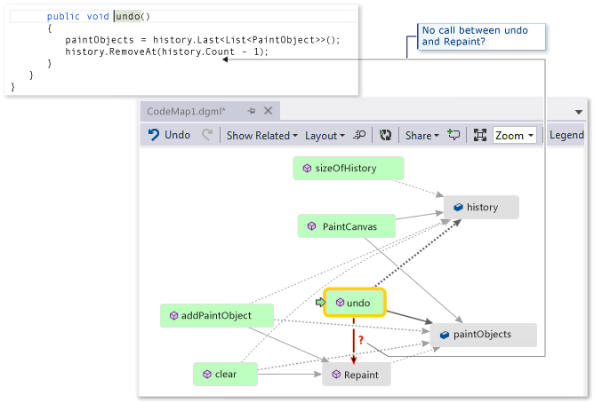  
  
 If you didn't have a map to show you this missing call, it might have been harder to find this problem, especially with more complex code.  
  
## Share your discovery and next steps  
 Before you or someone else fixes this bug, you can make notes on the map about the problem and how to fix it.  
  
 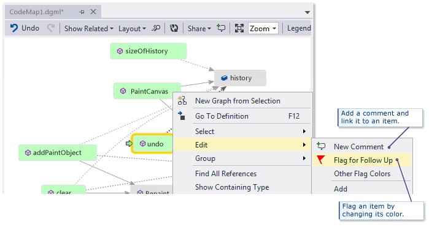  
  
 For example, you can add comments to the map and flag items using colors.  
  
 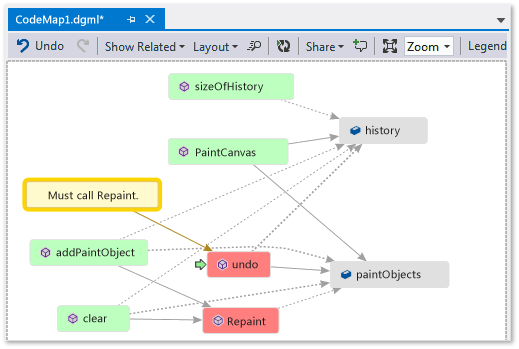  
  
 If you have Microsoft Outlook installed, you can email the map to others. You can also export the map as an image or another format.  
  
 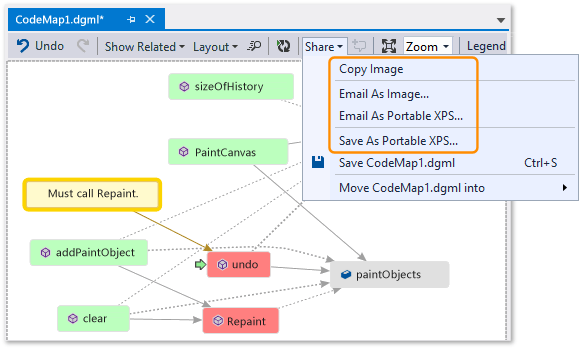  
  
## Fix the problem and show what you did  
 To fix this bug, you add the call for `Repaint` to `undo`.  
  
   
  
 To confirm your fix, you restart your debugging session and try to reproduce the bug. Now choosing **Undo my last stroke** works as you expect and confirms you made the correct fix.  
  
 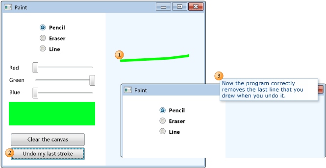  
  
 You can update the map to show the fix you made.  
  
 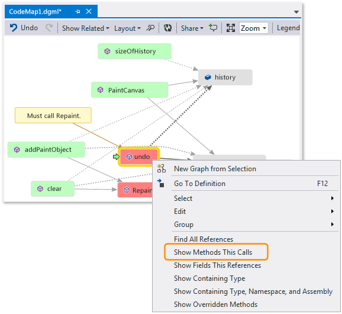  
  
 Your map now shows a link between **undo** and **Repaint**.  
  
 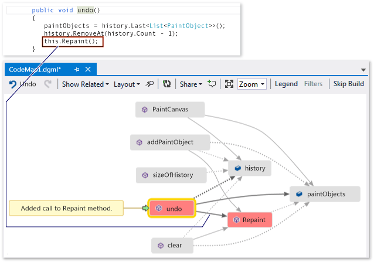  
  
> [!NOTE]
>  When you update the map, you might see a message that says the code index used to create your map was updated. This means someone changed the code, which causes your map to not match the current code. This doesn't stop you from updating the map, but you might have to recreate the map to confirm that it matches the code.  
  
 Now you’re done with your investigation. You successfully found and fixed the problem by mapping the code. You also have a map that helps you navigate around the code, remember what you learned, and shows the steps you took to fix the problem.  
  
## See Also  
 [Map methods on the call stack while debugging](../debugger/map-methods-on-the-call-stack-while-debugging-in-visual-studio.md)   
 [Visualize code](../modeling/visualize-code.md)