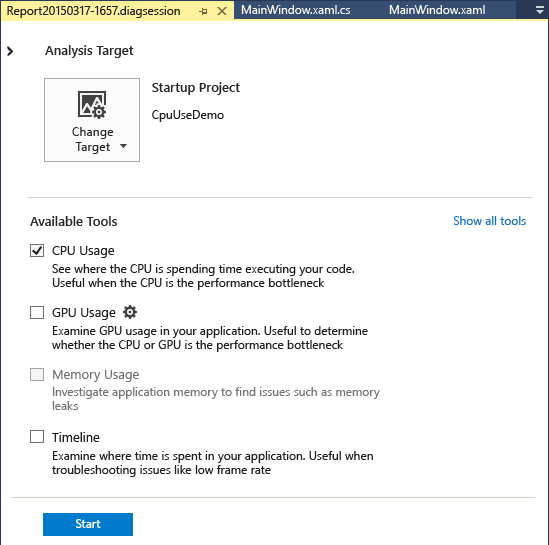
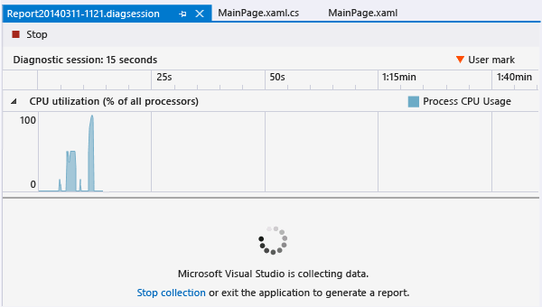
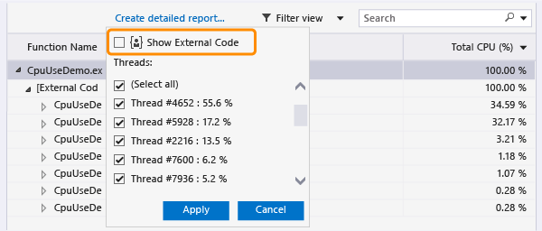
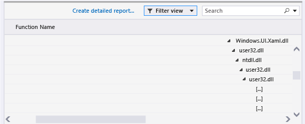

# CPU Usage
When you need to investigate performance issues in your app, a good place to start is understanding how it uses the CPU. The **CPU Usage** tool shows you where the CPU is spending time executing Visual C++, Visual C#/Visual Basic, and JavaScript code.  
  
 Starting in Visual Studio 2015 Update 1, you can see a per-function breakdown of CPU usage without leaving the debugger. You can turn CPU profiling on and off while debugging, and view the results when execution is stopped, for example at a breakpoint. For more information, see [Profile Your CPU in the Debugger in Visual Studio 2015](http://blogs.msdn.com/b/visualstudioalm/archive/2015/10/29/profile-your-cpu-in-the-debugger-in-visual-studio-2015.aspx).  
  
 For a walkthrough that analyzes the performance of a Windows Store app, see [Analyze CPU Usage in Store apps](https://msdn.microsoft.com/en-us/library/windows/apps/dn641982.aspx).  
  
 the Performance and Diagnostic hub offers you a lot of other options to run and manage your diagnostics session. For example, you can run the **CPU Usage** tool on local or remote machines, or on in a simulator or emulator. You can analyze the performance of an open project in Visual Studio, attached to a running app, or start an app that is installed from the Windows Store. For more information, see [Run profiling tools without debugging](http://msdn.microsoft.com/en-us/Library/e97ce1a4-62d6-4b8e-a2f7-61576437ff01)  
  
##   Collect CPU usage data  
  
1.  In Visual Studio, set the solution configuration to **Release** and choose the deployment target.  
  
       
  
    -   Running the app in **Release** mode gives you a better view of the actual performance of your app.  
  
    -   Running the app on the local machine best replicates the execution of the installed app.  
  
    -   If you are collecting data from a remote device, run the app directly on the device and not by using a Remote Desktop Connection.  
  
    -   For Windows Phone apps, collecting data directly from the **Device** provides the most accurate data.  
  
2.  On the **Debug** menu, choose **Performance Profiler...**.  
  
3.  Choose **CPU Usage** and then choose **Start**.  
  
       
  
4.  When the app starts, click **Get Max Number**. Wait about a second after the output is displayed, then choose **Get Max Number Async**. Waiting between button clicks makes it easier to isolate the button click routines in the diagnostic report.  
  
5.  After the second output line appears, choose **Stop Collection** in the Performance and Diagnostic hub.  
  
   
  
 The CPU Usage tool analyzes the data and displays the report.  
  
   
  
## Analyze the CPU Usage report  
  
###   The CPU Usage call tree  
 To get started understanding call tree information, reselect the `GetMaxNumberButton_Click` segment, and look at the call tree details.  
  
####   Call tree structure  
   
  
|||  
|-|-|  
||The top-level node in CPU Usage call trees is a pseudo-node|  
||In most apps, when the **Show External Code** option is disabled, the second-level node is an **[External Code]** node that contains the system and framework code that starts and stops the app, draws the UI, controls thread scheduling, and provides other low-level services to the app.|  
||The children of the second-level node are the user-code methods and asynchronous routines that are called or created by the second-level system and framework code.|  
||Child nodes of a method contain data only for the calls of the parent method. When **Show External Code** is disabled, app methods can also contain an **[External Code]** node.|  
  
####   External Code  
 External code are functions in system and framework components that executed by the code you write. External code include functions that start and stop the app, draw the UI, control threading, and provide other low-level services to the app. In most cases, you won’t be interested in external code, and so the CPU Usage call tree gathers the external functions of a user method into one **[External Code]** node.  
  
 When you want to view the call paths of external code, choose **Show External Code** from the **Filter view** list and then choose **Apply**.  
  
   
  
 Be aware that many external code call chains are deeply nested, so that the width of the Function Name column can exceed the display width of all but the largest of computer monitors. When this happens, function names are shown as **[…]**:  
  
   
  
 Use the search box to find a node that you are looking for, then use the horizontal scroll bar to bring the data into view:  
  
   
  
###   Call tree data columns  
  
|||  
|-|-|  
|**Total CPU (%)**|   The percentage of the app's CPU activity in the selected time range that was used by calls to the function and the functions called by the function. Note that this is different from the **CPU Utilization** timeline graph, which compares the total activity of the app in a time range to the total available CPU capacity.|  
|**Self CPU (%)**|   The percentage of the app's CPU activity in the selected time range that was used by the calls to the function, excluding the activity of functions called by the function.|  
|**Total CPU (ms)**|The number of milliseconds spent in calls to the function in the selected time range and the functions that were called by the function.|  
|**Self CPU (ms)**|The number of milliseconds spent in calls to the function in the selected time range and the functions that were called by the function.|  
|**Module**|The name of the module containing the function, or the number of modules containing the functions in an [External Code] node.|  
  
###   Asynchronous functions in the CPU Usage call tree  
 When the compiler encounters an asynchronous method, it creates a hidden class to control the method’s execution. Conceptually, the class is a state machine that includes a list of compiler-generated functions that call operations of the original method asynchronously, and the callbacks, scheduler, and iterators required to them correctly. When the original method is called by a parent method, the runtime removes the method from the execution context of the parent, and runs the methods of the hidden class in the context of the system and framework code that control the app’s execution. The asynchronous methods are often, but not always, executed on one or more different threads. This code is shown in the CPU Usage call tree as children of the **[External Code]** node immediately below the top node of the tree.  
  
 To see this in our example, re-select the `GetMaxNumberAsyncButton_Click` segment in the timeline.  
  
   
  
 The first two nodes under **[External Code]** are the compiler-generated methods of the state machine class. The third is the call to original method. Expanding the generated methods shows you what’s going on.  
  
   
  
-   `MainPage::GetMaxNumberAsyncButton_Click` does very little; it manages a list of the task values, computes the maximum of the results, and displays the output.  
  
-   `MainPage+<GetMaxNumberAsyncButton_Click>d__3::MoveNext` shows you the activity required to schedule and launch the 48 tasks that wrap the call to `GetNumberAsync`.  
  
-   `MainPage::<GetNumberAsync>b__b` shows you the activity of the tasks that call `GetNumber`.